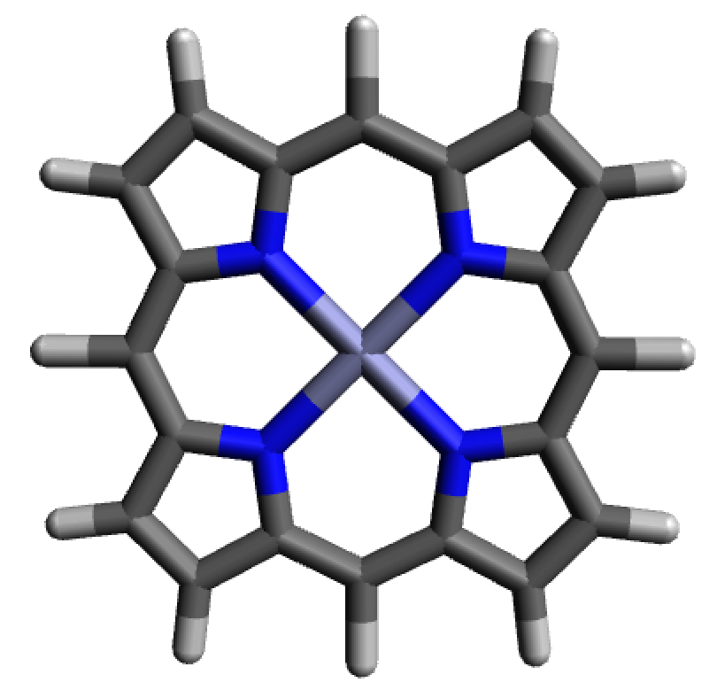
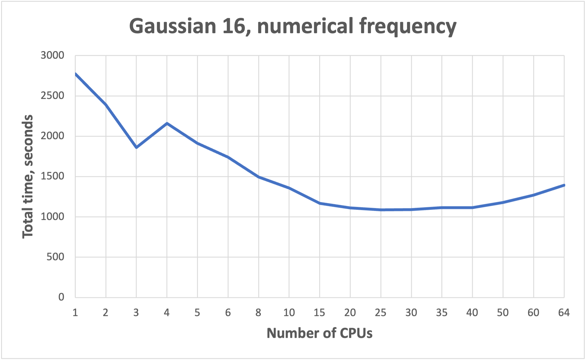

# Gaussian

***Important note:***  
**To run Gaussian, user should be added to the Gaussian group.**
Contact to `hpcsupport@taltech.ee`.

 

## Gaussian short introduction 

---

1. Make [gaussian.slurm](gaussian.slurm) batch script:

       #!/bin/bash
       #SBATCH --job-name=Job_Name
       #SBATCH --mem-per-cpu=2GB
       #SBATCH --nodes=1
       #SBATCH --ntasks=1
       #SBATCH --cpus-per-task=24
       #SBATCH -t 1-00:00:00
       #SBATCH --partition=common
       #SBATCH --no-requeue
    
        module load rocky8/all 
        module load gaussian/16.c02 
    
        SCRATCH=/state/partition1/$SLURM_JOB_ID
        export GAUSS_SCRDIR=$SCRATCH
        mkdir -p $SCRATCH
     
        g16 -m=48gb -p=24 < job.com > job.log
        
        #Clean after yourself
        rm -rf  $SCRATCH
    

2. Copy job-input file [job.com](job.com).

3. Submit the job on **base**:

	   sbatch gaussian.slurm

    ***NB!*** _More cores does not mean faster!!! See [benchmarks](https://docs.hpc.taltech.ee/chemistry/gaussian.html#benchmarks-for-parallel-jobs)._

4. Check results using [visualization software](visualization.md).

 
 

## Gaussian long version 

---

[Gaussian](https://gaussian.com/g16main/) is a general purpose package for calculation of electronic structures. It can calculate properties of molecules (structures, energies, spectroscopic and thermochemical properties, atomic charges, electron affinities, electrostatic potentials, electron densities etc.) as well as reactions properties (such as reaction pathways, IRC) using different methods (such as Molecular mechanics, Semi-empirical methods,  Hartree-Fock, Density functional theory, Møller-Plesset perturbation theory, coupled cluster). More about Gaussian features can be found [here](https://gaussian.com/g16glance/). 

### Environment

There are several versions of Gaussian available at HPC: g09 (revision C.01) and g16 (revision B.01, C.01 and C.02). Environment and Gaussian version are set up by the commands:

    module load rocky8/all
    module load gaussian/16.c02
    

### Running Gaussian jobs

Gaussian input files are executed by the commands `g09` or `g16` depending on the version of Gaussian used. This command is usually placed in `slurm` script.

    g16 < job.com > job.log

#### Single core calculations

Gaussian by default executes jobs on only a single processor. 

***NB!*** _If more processors are defined in `slurm` script, they will be reserved but not used_.

#### Parallel jobs

To run multiple processors/cores job  a number of cores should be specified. The number of cores can be defined via the `-p` flag (e.g. -p=4) in command line of `slurm` script or by adding the `%NprocShared` keyword into  Gaussian input file (e.g. %NprocShared=4). For more information see [Gaussian manual](https://gaussian.com/running/). The number of processors requested should correspond to the number of processors requested in `slurm` script.

***NB!*** _More cores does not mean faster!!! See [benchmarks](https://docs.hpc.taltech.ee/chemistry/gaussian.html#benchmarks-for-parallel-jobs)._

Example of `slurm` script:

    #!/bin/bash
    
    #SBATCH --job-name=Job_Name	# Job name
    #SBATCH --mem=8GB		# Memory
    #SBATCH --nodes=1		# Number of nodes 
    #SBATCH --ntasks=1		# Number of threads 
    #SBATCH --cpus-per-task=4
    #SBATCH -t 1-00:00:00		# Time
    #SBATCH --partition=common	# Partition
    #SBATCH  --no-requeue		# Job will not be restarted by default 
    
    module load rocky8/all
    module load gaussian/16.c02
    
    SCRATCH=/state/partition1/$SLURM_JOB_ID
    export GAUSS_SCRDIR=$SCRATCH
    mkdir -p $SCRATCH   
    
    g16 < job.com > job.log

	rm -rf  $SCRATCH

Example of Gaussian input:

    %Mem=8GB
    %NprocShared=4
    %chk=job.chk
    #P B3LYP/6-311++G** Opt EmpiricalDispersion=GD3BJ 
    
    Job_Name

    0,1
    C          0.67650        0.42710        0.00022
    H          0.75477        1.52537        0.00197
    O          1.62208       -0.30498       -0.00037
    S         -1.01309       -0.16870        0.00021
    H         -1.58104        1.05112       -0.00371
    
    
### Memory

The default dynamic memory requested by Gaussian is frequently too small for successful job termination. Herein, if amount of memory requested is insufficient, the job will crash. There is no golden rule for memory requests. Usually, for common calculations (e.g. optimization, frequency etc.)  2 GB per 1 core is sufficient. This can be done by the `-m` flag in the command line (e.g. -m=48gb) or by adding the `%Mem` keyword in Gaussian input file (e.g. %Mem=2GB). For more information see [Gaussian manual](https://gaussian.com/running/) and [taltech user-guides](https://docs.hpc.taltech.ee/index.html#hardware-specification).

However, there are calculations that require more memory (e.g TD-DFT, large SCF calculations, etc.). Data from a `slurm-JOBID.stat` file can be useful to determine the amount of memory required for a computation. In `slurm-JOBID.stat` file the efficiency of memory utilization is shown. 

Bad example:

    Memory Utilized: 3.08 GB 
    Memory Efficiency: 11.83% of 26.00 GB

Good example:

    Memory Utilized: 63.12 GB 
    Memory Efficiency: 98.62% of 64.00 GB

### Time

Time limits depend on [time partition](https://docs.hpc.taltech.ee/index.html#hardware-specification) used. If calculation time exceeds the time limit requested in the `slurm` script, the job will be killed, and in the end of `slurm-JOBID.out` will be written "error: *** JOB 317255 ON green23 CANCELLED AT 2023-08-11T22:28:01 DUE TO TIME LIMIT *** "

Therefore, it is recommended to request more time than is usually needed for calculation and create checkpoint files (by `%chk=job.chk` line in input file) that allows to restart job.

### Using GPUs

GPUs **are effective** for large molecules, their energies, gradients and frequencies calculations. GPUs **are not effective** for small jobs, as well as for MP2 or CCSD calculations. 

GPU jobs can be run only on **amp** or **amp2**. To access **amp** user has to have ssh-keys copied to the **base** ([how to do that](../ssh.md)).

**amp** can be accessed by command:

    ssh -J uni-ID@base.hpc.taltech.ee uni-ID@amp
    

Each GPU must be controlled by a specific CPU, wherein, CPUs used as GPU controllers do not participate as compute nodes during the calculations.

The GPUs and CPUS used for calculations are specified with the `%GPUCPU` command, where gpu- and cpu-lists are a comma-separated lists, possibly including numerical ranges (e.g., 0-4,6). The corresponding items in the two lists are the GPU and its controlling CPU.

    %cpu=0-9
    %gpucpu=0-1=0-1

***NB!*** _The controlling CPUs are included in `%CPU` command._   
***NB!*** _The GPU and CPU count starts from zero._

Example of [gaussian-gpu.slurm](gaussian-gpu.slurm) script for **amp**:

    #!/bin/bash
    #SBATCH --job-name=Job_Name
    #SBATCH -t 1:00:00
    #SBATCH  --no-requeue
    #SBATCH --partition=gpu		# Partition
    #SBATCH --gres=gpu:A100:2	# 2 GPU are reserved
    #SBATCH --nodes=1
    #SBATCH --ntasks=1
    #SBATCH --cpus-per-task=10	# 10 CPU are reserved
    #SBATCH --mem=160GB		# Memory

    module use /gpfs/mariana/modules/system
    module load amp/all
    module load Gaussian/16.c02
    
    SCRATCH=/state/partition1/$SLURM_JOB_ID
    export GAUSS_SCRDIR=$SCRATCH
    mkdir -p $SCRATCH

    g16 job.com > job.log

    #Clean after yourself
    rm -rf  $SCRATCH

Example of Gaussian input [job-gpu.com](job-gpu.com) (bad example, since molecule is small):

    %mem=160GB
    %cpu=0-9
    %gpucpu=0-1=0-1
    # wb97xd/cc-pVDZ opt

    GPU test

    0 1
    N                  0.15134980    0.09540020    1.45819090
    C                  0.75130720   -1.21343470    1.83361500
    H                 -0.39763650    0.48328420    2.23924210
    H                  0.89227330    0.78663430    1.26643050
    C                  2.08354180   -1.05427080    2.58684570
    H                  2.46028270   -2.07052410    2.83958100
    H                  1.89047670   -0.54642730    3.56027240
    H                  0.94017970   -1.74157910    0.87502690
    C                 -0.27659390   -2.02386680    2.62322330
    H                 -1.22744720   -2.09807790    2.06259160
    H                  0.09671630   -3.04868580    2.81503150
    H                 -0.48448270   -1.55043170    3.60777900
    C                  3.18448030   -0.29819020    1.82025510
    C                  4.47118690   -0.16399430    2.65811660
    C                  3.50345720   -0.94054930    0.45675520
    H                  2.82725210    0.74302520    1.61940860
    C                  5.57163930    0.60375030    1.90697440
    H                  4.83763400   -1.18683360    2.90651280
    H                  4.24528280    0.32880900    3.62913610
    C                  4.59840130   -0.17643230   -0.29951390
    H                  3.82853470   -1.99290760    0.62773340
    H                  2.59267050   -0.99453480   -0.16920790
    C                  5.87589210   -0.03780040    0.54257470
    H                  6.49233690    0.65984540    2.52562860
    H                  5.23630520    1.65412070    1.74873850
    H                  4.81114970   -0.67947290   -1.26682010
    H                  4.21177720    0.83532620   -0.55856640
    H                  6.64325110    0.55322730   -0.00130230
    H                  6.31606730   -1.04822960    0.70571860

#### Allocation of memory

Allocating sufficient amounts of memory for GPU jobs is even more important when for CPU jobs. GPUs can have up to 40GB (**amp1**) and 80GB (**amp2**) of memory, wherein, must be at least an equal amount of memory given to the GPU and each control CPU thread from available 1 TB of RAM.

Gaussian gives equal shares of memory to each thread, this means that the total memory allocated should be the number of threads times the memory required. 

### _Restarting a failed/interrupted calculation_

Killed or failed jobs can be restarted, but for this checkpoint file should be generated via a `%Chk` command within the Gaussian input file. For more information see  [Gaussian FAQ](https://gaussian.com/faq2/), [Gaussian restart](https://gaussian.com/restart/) and [Using Gaussian Checkpoint Files](http://www.ccl.net/cca/documents/dyoung/topics-orig/checkpoint.html).

***NB!*** _Checkpoint files are very heavy and are readable only on the machine on which they were generated. After successful completion of the calculation, it is recommended to delete these files._

#### How to cite:

- _Gaussian 16 - [https://gaussian.com/citation/](https://gaussian.com/citation/)_
- _Gaussian 09 - Gaussian 09, Revision C.01, Frisch, M.J.; Trucks, G.W.; Schlegel, H.B.; Scuseria, G.E.; Robb, M.A.; Cheeseman, J.R.; Scalmani, G.; Barone, V.; Mennucci, B.; Petersson, G.A.; Nakatsuji, H.; Caricato, M.; Li, X.; Hratchian, H.P.; Izmaylov, A.F.; Bloino, J.; Zheng, G.; Sonnenberg, J.L.; Hada, M.; Ehara, M.; Toyota, K.; Fukuda, R.; Hasegawa, J.; Ishida, M.; Nakajima, T.; Honda, Y.; Kitao, O.; Nakai, H.; Vreven, T.; Montgomery, J.A., Jr.; Peralta, J.E.; Ogliaro, F.; Bearpark, M.; Heyd, J.J.; Brothers, E.; Kudin, K.N.; Staroverov, V.N.; Kobayashi, R.; Normand, J.; Raghavachari, K.; Rendell, A.; Burant, J.C.; Iyengar, S.S.; Tomasi, J.; Cossi, M.; Rega, N.; Millam, N.J.; Klene, M.; Knox, J.E.; Cross, J.B.; Bakken, V.; Adamo, C.; Jaramillo, J.; Gomperts, R.; Stratmann, R.E.; Yazyev, O.; Austin, A. J.; Cammi, R.; Pomelli, C.; Ochterski, J. W.; Martin, R.L.; Morokuma, K.; Zakrzewski, V.G.; Voth, G.A.; Salvador, P.; Dannenberg, J.J.; Dapprich, S.; Daniels, A.D.; Farkas, Ö.; Foresman, J.B.; Ortiz, J.V.; Cioslowski, J.; Fox, D.J. Gaussian, Inc., Wallingford CT, 2009._
 

### Benchmarks for parallel jobs

Gaussian example benchmarks performed with Gaussian 16 C01.  
The job had 37 atoms.

 

 

