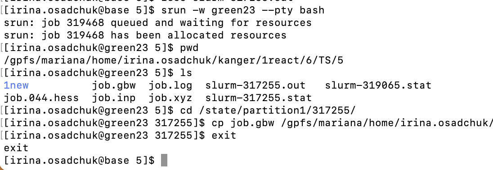

# ORCA

***Important note:***  
**To run ORCA, user must registered individually and have agreed to the EULA at** [Orcaforum](https://orcaforum.kofo.mpg.de/app.php/portal).

 

## ORCA short introduction 

---

1. Make [orca.slurm](orca.slurm) batch script for parallel calculations:

       #!/bin/bash
       #SBATCH --job-name=ORCA-test
       #SBATCH --mem=48GB
       #SBATCH --nodes=1
       #SBATCH --ntasks=24
       #SBATCH --cpus-per-task=1
       #SBATCH -t 1-00:00:00
       #SBATCH --partition=common
       #SBATCH  --no-requeue
    
        module load rocky8/all
        module load orca/5.0.4
        export orcadir=/gpfs/mariana/software/green/Orca/orca_5_0_4_openmpi_411/

        #Create scratch directory
        SCRATCH=/state/partition1/$SLURM_JOB_ID
        mkdir -p $SCRATCH
        cp  $SLURM_SUBMIT_DIR/* $SCRATCH/
        cd $SCRATCH/

        #Run calculations 
        $orcadir/orca job.inp > $SLURM_SUBMIT_DIR/job.log

        #Copy files back to working directory
        cp $SCRATCH/* $SLURM_SUBMIT_DIR
        rm *tmp*
        
        #Clean after yourself
        rm -rf  $SCRATCH

    or [orca-single-core.slurm](orca-single-core.slurm) batch script for single core calculations:
    

 Click to expand 

    
       #!/bin/bash
       #SBATCH --job-name=Job_Name
       #SBATCH --mem=2GB
       #SBATCH --nodes=1   
       #SBATCH --ntasks=1
       #SBATCH --cpus-per-task=1
       #SBATCH -t 10:00:00
       #SBATCH --partition=common
       #SBATCH  --no-requeue
    
        module load rocky8/all
        module load orca/5.0.4
        export orcadir=/gpfs/mariana/software/green/Orca/orca_5_0_4_openmpi_411/
        
        #Create scratch directory
        SCRATCH=/state/partition1/$SLURM_JOB_ID
        mkdir -p $SCRATCH
        cp  $SLURM_SUBMIT_DIR/* $SCRATCH/
        cd $SCRATCH/

        #Run calculations 
        $orcadir/orca job.inp > $SLURM_SUBMIT_DIR/job.log

        #Copy files back to working directory
        cp $SCRATCH/* $SLURM_SUBMIT_DIR
        rm *tmp*
        
        #Clean after yourself
        rm -rf  $SCRATCH
    
    
  

2. Copy job-input file [job.inp](job.inp) (for single core run remove core specification block).

3. Submit the job on **base**:

        sbatch orca.slurm

    ***NB!*** _More cores does not mean faster!!! See [benchmarks](https://docs.hpc.taltech.ee/chemistry/orca.html#benchmarks-for-parallel-jobs)._  
    ***NB!*** To ORCA parallel run full path name is needed. Single core calculations can be performed with just `orca` command.

4. Check results using [visualization software](visualization.md).

 
 

## ORCA long version 

---

### Environment

There are currently only latest ORCA 5.0.4 version is available. Environment is set up by the commands:

    module load rocky8/all
    module load orca/5.0.4

The first time use, user has to agree to the licenses:
 
    touch ~/.licenses/orca-accepted 

if this is the first user license agreement, the following commands should be given:

    mkdir .licenses
    touch ~/.licenses/orca-accepted  

***NB!*** After agreeing to the license, user has **to log out and log in again** to be able run ORCA.  

### Running ORCA jobs

ORCA input files are executed by the command `orca`. This command is usually placed in `slurm` script.

***NB!*** To ORCA parallel run full path name is needed, but single core calculations can be performed with just `orca` command.

    /gpfs/mariana/software/green/Orca/orca_5_0_4_openmpi_411/orca job.inp

#### Single core calculations

ORCA by default execute jobs on only a single processor.  
Example of ORCA input:

    ! RI BP86 def2-SVP def2/J D4 printbasis Opt 

    %maxcore 2000 	#Use up to 2 GB of memory

    *xyz 0 1
    C          0.67650        0.42710        0.00022
    H          0.75477        1.52537        0.00197
    O          1.62208       -0.30498       -0.00037
    S         -1.01309       -0.16870        0.00021
    H         -1.58104        1.05112       -0.00371
    *

Example of an [orca-single-core.slurm](orca-single-core.slurm) batch script for single core calculations.

***NB!*** _If in `slurm`script is defined more processors, they will be reserved, but not utilized._

#### Parallel jobs

To run multiple processors/cores job a number of cores should be specified both in ORCA input file and in `slurm` script. In ORCA it is done with `PAL` keyword (e.g. PAL4) or as a block input.

Example of ORCA input for 4 cores:

    ! RI BP86 def2-SVP def2/J D4 printbasis Opt 

    %maxcore 2000  	#Use up to 2 GB of memory

    %pal nprocs 4 end 	#Use 4 cores

    *xyz 0 1
    C          0.67650        0.42710        0.00022
    H          0.75477        1.52537        0.00197
    O          1.62208       -0.30498       -0.00037
    S         -1.01309       -0.16870        0.00021
    H         -1.58104        1.05112       -0.00371
    *

Example of `slurm` script:

    #!/bin/bash
    #SBATCH --job-name=ORCA-test		# Job name
    #SBATCH --mem=8GB		        # Memory 
    #SBATCH --nodes=1			# Number of nodes 
    #SBATCH --ntasks=4			# Number of threads 
    #SBATCH --cpus-per-task=1
    #SBATCH -t 2:00:00			# Time
    #SBATCH --partition=common		# Partition
    #SBATCH  --no-requeue			# Job will not be restarted by default 
    
    module load rocky8/all
    module load orca/5.0.4
    export orcadir=/gpfs/mariana/software/green/Orca/orca_5_0_4_openmpi_411/

    #Create scratch directory
    SCRATCH=/state/partition1/$SLURM_JOB_ID
    mkdir -p $SCRATCH
    cp  $SLURM_SUBMIT_DIR/* $SCRATCH/
    cd $SCRATCH/

    #Run calculations 
    $orcadir/orca job.inp > $SLURM_SUBMIT_DIR/job.log

    cp $SCRATCH/* $SLURM_SUBMIT_DIR
        
    #Clean after yourself
    rm -rf  $SCRATCH

 ***NB!*** _To ORCA parallel run full path name is needed._  

More about ORCA input can be found at [ORCA Input Library](https://sites.google.com/site/orcainputlibrary/home), [ORCA tutorials](https://www.orcasoftware.de/tutorials_orca/) and [ORCA forum](https://orcaforum.kofo.mpg.de/).
    
### Memory

The default dynamic memory requested by ORCA is frequently too small for successful job termination. If amount of memory requested is insufficient, the job will be killed and in `slurm-JOBID.out` will appear _ "... have been killed by the cgroup **out-of-memory handler**". _ 

Memory usage in ORCA is controlled by the `%maxcore` keyword.

    %maxcore 2000

There is no golden rule for memory requests, since they are  basis set and calculation type dependant. Usually, 2-8 GB per 1 CPU (thread) is sufficient. If Resolution of the identity (RI) approximation is used, the memory must be increased.  

Data from a `slurm-JOBID.stat` file can be useful to determine the amount of memory required for a computation. In `slurm-JOBID.stat` file the efficiency of memory utilisation is shown. 

Bad example:

    Memory Utilized: 3.08 GB 
    Memory Efficiency: 11.83% of 26.00 GB

Good example:

    Memory Utilized: 63.12 GB 
    Memory Efficiency: 98.62% of 64.00 GB

### Time

Time limits depend on time partition used, see [taltech user-guides](https://docs.hpc.taltech.ee/index.html#hardware-specification). Therefore, it is recommended to request more time than is usually needed for calculation. 

If job was killed due to the time limit, this will be written in the end of  `slurm-JOBID.out` file "error: *** JOB 317255 ON green23 CANCELLED AT 2023-08-11T22:28:01 DUE TO TIME LIMIT *** "

In this case some files including checkpoint file `gbw` will not be copied back to the working directory. To copy files user need to run interactive session to connect to the node where calculations were done. The node number is written in both `slurm-JOBID.stat` and `slurm-JOBID.out`. In example error message it was green23. 

Interactive session is started by the command:

    srun -w greenXX --pty bash	# connect to green node
    pwd				# see path to working directory
    ls				# see JOBID from slurm
    cd /state/partition1/JOBID	# go to corresponding directory on green node
    cp job.gbw /gpfs/mariana/home/....../ # copy files needed to your working directory

    exit				# terminate interactive session

where `XX` - is the node number and `JOBID` - job serial number.

 

### Restarting a failed/interrupted calculation

All ORCA jobs are restart jobs as default. 

SCF calculations with input file name `job.inp` will automatically search for a file named `job.gbw` and will attempt to read in the old orbitals and continue the SCF from there.

`MOREAD` and `%moinp` keywords allows manually specify where to read the orbitals from. 

    ! MORead
    %moinp "job2.gbw" 
    # Note that if job2.gbw is the gbw file you read in then job2.inp can not be the name of the inputfile. 
    *xyz 0 1

Geometry optimisation is recommended to be restarted using the last geometry (`job.xyz`).     
    
Numerical frequency calculations also can be restarted if `.hess` files from the previous calculation are presented.

    !
    %freq 
    restart true
    end

**NB!** _Checkpoint files are very heavy and after successful completion of the calculation, it is recommended to delete these files._ 

#### Coping files 

During calculations ORCA creates many different additional files, by default, `slurm` copies all files to the user's directory. However, the user can choose which files to copy back to the working directory.

    cp $SCRATCH/*.gbw  $SLURM_SUBMIT_DIR/
    cp $SCRATCH/*.engrad  $SLURM_SUBMIT_DIR/
    cp $SCRATCH/*.xyz  $SLURM_SUBMIT_DIR/
    cp $tdir/*.log  $SLURM_SUBMIT_DIR/
    cp $tdir/*.hess  $SLURM_SUBMIT_DIR/

#### How to cite:

- [Neese, F. (**2012) The ORCA program system, _Wiley Interdiscip. Rev.: Comput. Mol. Sci.,_ 2, 73-78.](https://doi.org/10.1002/wcms.81)
- [Neese, F. (2017) Software update: the ORCA program system, version 4.0, _Wiley Interdiscip. Rev.:_ Comput. Mol. Sci., 8, e1327.](https://doi.org/10.1002/wcms.1327)
- [Neese, F. (2022) Software update: The ORCA program system—Version 5.0, _WIREs Computational Molecular Science,_ 12, e1606.](https://doi.org/10.1002/wcms.1606)

 

##### _Additional Information_

- [Official ORCA website](https://orcaforum.kofo.mpg.de/)
- [ORCA Input Library](http://sites.google.com/site/orcainputlibrary/)
- [ORCA compound scripts repository](https://github.com/ORCAQuantumChemistry/CompoundScripts/)
- [ORCA Tutorials by FAccTs](https://www.orcasoftware.de/tutorials_orca/)

 

### Benchmarks for parallel jobs

 

