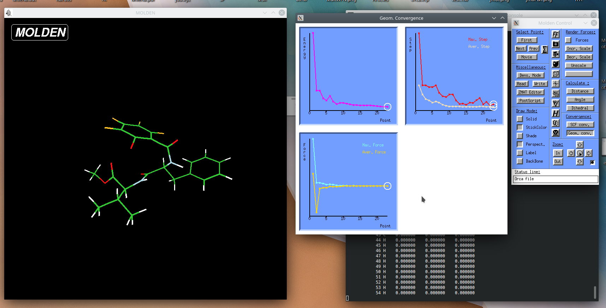
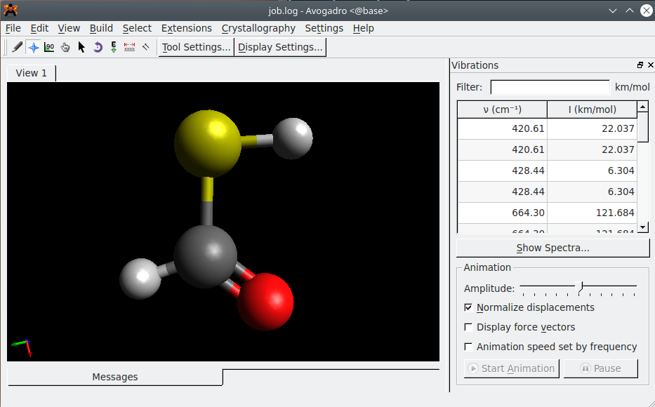
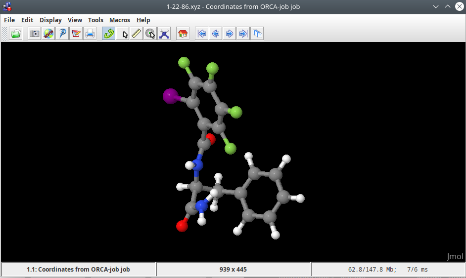
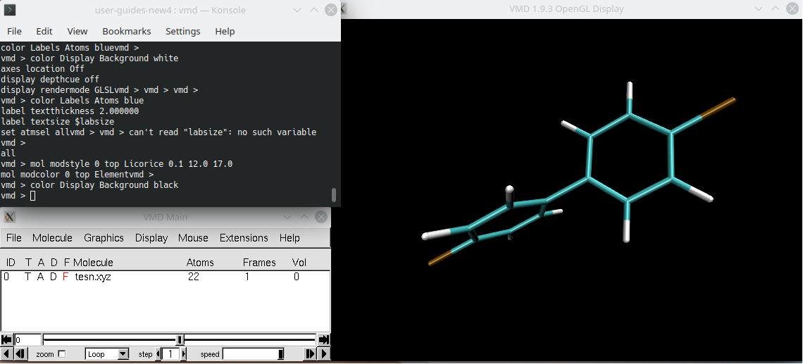

not changed to rocky yet

# Visualization software for computational chemistry, biology and physics

Visualization mostly should be done on **viz** ([Molden](https://docs.hpc.taltech.ee/chemistry/visualization.html#molden), [Avogadro](https://docs.hpc.taltech.ee/chemistry/visualization.html#avogadro), [JMol](https://docs.hpc.taltech.ee/chemistry/visualization.html#jmol) or [VMD](https://docs.hpc.taltech.ee/chemistry/visualization.html#vmd)), but also short-time geometry checks are possible on **base** ([Molden](https://docs.hpc.taltech.ee/chemistry/visualization.html#molden), [Avogadro](https://docs.hpc.taltech.ee/chemistry/visualization.html#avogadro) or [JMol](https://docs.hpc.taltech.ee/chemistry/visualization.html#jmol)). 

 
 

## Short introduction 

---

1. Accesse **viz** by [remote access programs](../visualization.md) (more preferable) or by ssh protocol (less preferable):
 
        ssh -X -Y -J  UNI-ID@base.hpc.taltech.ee UNI-ID@viz

2. Load enviroment (gray or gray/spack/):

        module load viz-spack
        module load jmol

3. Run visualization program (`jmol`, `molden`, `avogadro`, `vmd` or  `rasmol`):

        jmol job.xyz

# Visualization long version 

 

## Molden 

---

[Molden](https://www.theochem.ru.nl/molden/) is a nice program for visualization the results of quantum chemical calculations. 

Molden is a quite universal:

- reads various input and output formats, 
- can be used as a Z-matrix editor,
- shows optimization paths,
- animates reaction paths and molecular vibrations,
- displays molecular orbitals and electron densities.

 

### Environment

On **viz** environment is set up by the commands:

    module load viz-spack
    module load molden

On **base** environment is set up by the commands:

    module load green/all
    module load molden

### Running Molden

Molden is executed by command `molden` and reads `.xyz`, Gaussian and ORCA outputs, etc.  

    molden job.out

Some useful links:

- [Molden manual](https://www.theochem.ru.nl/molden/)
- Building molecule [video](https://www.youtube.com/watch?v=t-Lf2ti6fxE)
- Calculation results visualization [video](https://www.youtube.com/watch?v=sRvuJno1zW4) (includes showing optimization path and molecular vibrations)

 

### How to cite: 

Molden 6.7:

- [DOI:10.1007/s10822-017-0042-5](https://link.springer.com/article/10.1007/s10822-017-0042-5)
- [DOI:10.1023/A:1008193805436](https://link.springer.com/article/10.1023/A:1008193805436)

 
  
 

## Avogadro

---

[Avogadro](https://avogadro.cc/docs/) is an advanced molecule editor and visualizer designed for computational chemistry, molecular modeling, bioinformatics, materials science, and related areas. 

Avogado has many useful options:

- construction of molecules from fragments,
- Z-matrix generation,
- geometry optimization,
- measurements,
- performing a conformational search,
- reading various input and output formats,
- showing of molecular orbitals and electron density,
- animation of reaction paths and molecular vibrations,
- construction of IR spectra.

 

### Environment

On **viz** there is a native install of Avogadro (no modules needed).

On **base** environment is set up by the commands:

    module load green/all
    module load Avogadro

### Running Avogadro

Avogadro is executed by command `avogadro` and reads various input and output formats.

     avogadro job.log
 

Some useful links:

- [Avogadro manual](avogadro.pdf)
- Building molecule [video I](https://www.youtube.com/watch?v=LOZswm07j0U), [video II](https://www.youtube.com/watch?v=UWR4hPbtrHE), [video III](https://www.youtube.com/watch?v=fA3odPmkV-U), [changing molecule](https://www.youtube.com/watch?v=6O4DEoETAnU) (including optimization)
- Orbitals visualization [video](https://www.youtube.com/watch?v=WpyqqDwspoo)
- Molecular vibrations & IR spectra [video](https://www.youtube.com/watch?v=AScn1OuyBoY)

  
 
 
 
### How to cite: 

- Avogadro 1.2.0 available at [http://avogadro.cc/](http://avogadro.cc/)
- [DOI: 10.1186/1758-2946-4-17](https://jcheminf.biomedcentral.com/articles/10.1186/1758-2946-4-17)

  
  
 

## JMol

---

[JMol](http://jmol.sourceforge.net/) is a free, open source viewer of molecular structures that supports a wide range of chemical file formats.

JMol has following possibilities:

- visualization of animation,
- visualization of vibration,
- visualization of surfaces,
- visualization of orbitals,
- schematic shapes for secondary structures in biomolecules,
- measurements.

 

### Environment

On **viz** environment is set up by the commands:

    module load green-spack
    module load jmol

On **base** by the commands:
 
    module load green-spack 
    module load jmol

### Running JMol

JMol is executed by command `jmol` and reads `.xyz`, `.pdb`, `.mol` formats, etc.  

    jmol job.pdb
 
 
 
### How to cite: 
Jmol 14.31.0: an open-source Java viewer for chemical structures in 3D. Available at [http://www.jmol.org/](http://www.jmol.org/).

 
 

## VMD

---

[Visual Molecular Dynamics (VMD)](http://www.ks.uiuc.edu/Research/vmd/) is a molecular modelling and visualization program designed of biological systems. It supports over 60 file formats and has user-extensible graphical and text-based interfaces, as well as built-on standard Tcl/Tk and Python scripting languages. VMD provides a wide range of methods for visualizing and coloring molecules or atom subsets and an extensive selection syntax for subsets of atoms and has no limits on the number of molecules, atoms, residues or trajectory frames. 

VMD has the following features:

- animation of MD trajectories,
- analysis of MD trajectories,
- analysis of sequences and structures of proteins and nucleic acids,
- ability to export graphics to files that can be processed by ray tracing and image rendering packages,
- ability to write molecular analysis programs in the Tcl language.

 
 

Some useful links:

- [VMD manual](vmd.pdf)
- [Many tutorials](http://www.ks.uiuc.edu/Research/vmd/current/docs.html#tutorials)
- Short introduction [video](https://www.youtube.com/watch?v=0KxdmnbodNw)
- Long introduction [video](https://www.youtube.com/watch?v=_skmrS6X4Ys)

 

### Environment

The first time use, the user has to read the license at https://www.ks.uiuc.edu/Research/vmd/current/LICENSE.html the software can only be used if the license is accepted! If you agree to the license, do: 
        
    touch ~/.licenses/vmd-accepted 

after that it is needed to unload module and load it again by commands:

    module unload VMD/1.9.3-text
    module load VMD

if this is the first time you accept a license agreement, the following commands should be given:

    mkdir .licenses
    touch ~/.licenses/vmd-accepted 
    module unload VMD/1.9.3-text
    module load VMD

On **viz** environment is set up by the commands:

    module load viz
    module load VMD

        
On **base** environment is set up by the commands:

    module load green
    module load VMD 
        
User also needs to agree with the licenses, as described above.    
    
    
### Running VMD

VMD is executed by command `vmd` and reads various input and output formats.  

    vmd job.mol
    
    
 
 
 
### How to cite: 

- VMD 1.9.4 available at [http://www.ks.uiuc.edu/Research/vmd/](http://www.ks.uiuc.edu/Research/vmd/)
- DOI:[10.1016/0263-7855(96)00018-5](https://www.sciencedirect.com/science/article/abs/pii/0263785596000185)
 

<b>In addition, the following articles should be cited depending on the functionalities used:</b>

- Interactive Molecular Dynamics - DOI:[10.1145/364338.364398](https://dl.acm.org/doi/10.1145/364338.364398)
- Multiple Alignment Plugin - DOI:[10.1093/bioinformatics/bti825](https://academic.oup.com/bioinformatics/article/22/4/504/184006)
- Tachyon ray tracing library - John Stone ["An Efficient Library for Parallel Ray Tracing and Animation"](https://scholarsmine.mst.edu/cgi/viewcontent.cgi?article=2746&context=masters_theses), _Computer Science Department, University of Missouri-Rolla,_ **1998**
- STRIDE Secondary Structure Prediction - DOI:[10.1002/prot.340230412](https://onlinelibrary.wiley.com/doi/abs/10.1002/prot.340230412?casa_token=RH2f-1gBiPAAAAAA:dB4V2-CCPt_VIL_cv5Hi9U5S_blWaykCF69Mu5hfXNhKBd8r1PXeUD-2GHRsKFYgRI8ZLqNiG_2b0uwXtw)
- SURF solvent accessible surface calculator - DOI:[10.1109/38.310720](https://ieeexplore.ieee.org/document/310720)
- MSMS solvent excluded surface calculator - DOI:[doi/10.1145/220279.220324](https://dl.acm.org/doi/10.1145/220279.220324)
- Speech and gesture recognition - DOI:[10.1109/38.824531](https://ieeexplore.ieee.org/document/824531)

 
 
 

## RasMol

---

[RasMol](http://www.openrasmol.org/) is a molecular graphics program for visualisation of proteins, nucleic acids and small molecules.  RasMol provides  a variety of colour schemes and molecule representations. In RasMol, different parts of the molecule may be represented and coloured independently of the rest of the molecule or displayed in several representations simultaneously, and atoms may also be labelled with arbitrary text strings. In addition, RasMol can read a prepared list of commands from a 'script' file.
Supported input file formats are `.pdb`, `.mol2`, `.mdl`, `.msc`, `.xyz`, `.xmol`, CHARMm and CIF formats files. 
Finally, the rendered image may be written in a variety of formats such as GIF, PPM, BMP, PICT, Sun rasterfile or as a MolScript input script or Kinemage.

RasMol is available on **viz** just by common `rasmol`.

    rasmol job.mol

Some useful links:

- [RasMol manual](http://www.rasmol.org/software/RasMol_Latest_Manual.html)
- tutorial for beginners [part 1](https://www.youtube.com/watch?v=cq5lpR2Hqgw), [part 2](https://www.youtube.com/watch?v=HXIkwW539jU)

 

### How to cite:

Herbert J. Bernstein, 2009. RasMol, available at: [http://www.rasmol.org/](http://www.rasmol.org/).
 
 
