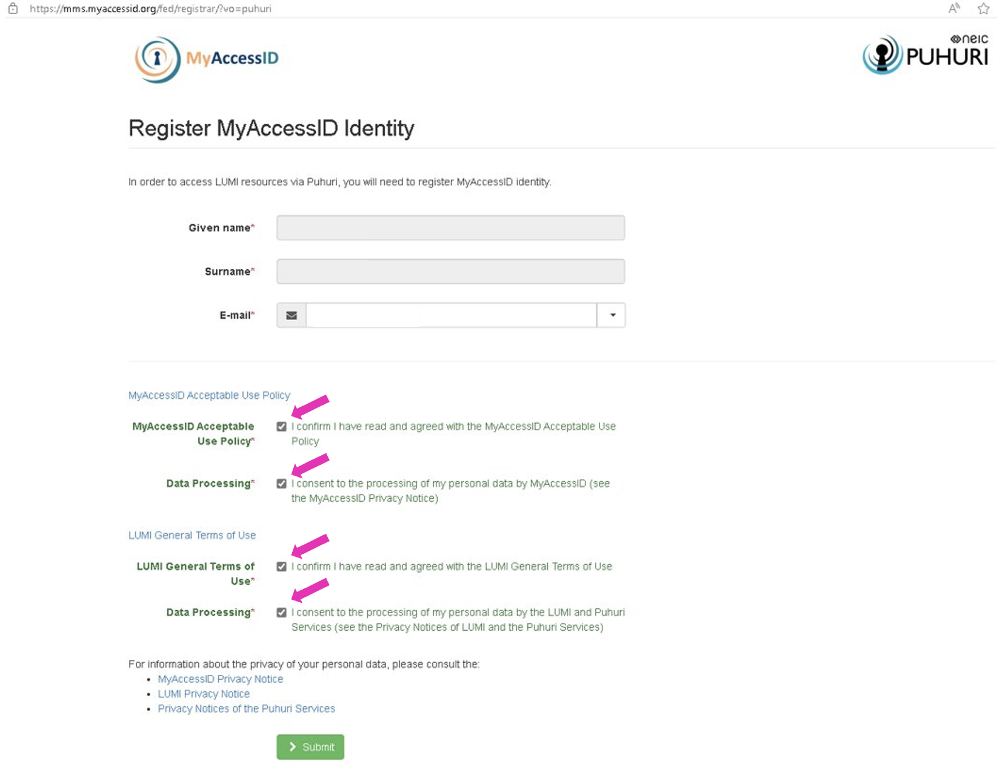

# Quickstart: Cloud 

 

## Access to OpenStack Cloud (short introduction) 

---

In order to gain access to HPC Centre Cloud, you should take following steps:

1.  Login to ETAIS <https://minu.etais.ee> and authenticate with your TalTech UniID credentials via MyAccessID.
2. Upload your SSH Public Key to ETAIS Portal.
3. Contact us by email (hpcsupport@taltech.ee), in Teams (HPC Support Chat) or through [Helpdesk](https://taltech.atlassian.net/servicedesk/customer/portal/18) to be added to a Project.
4. Get familiar with ETAIS documentation [here](https://etais.ee/using/).

 
 

## Access to OpenStack Cloud (long version)

---

HPC Centre runs OpenStack-based Cloud. In order to gain access to it, you should take following steps:

1. Login to ETAIS <https://minu.etais.ee> and authenticate with your TalTech UniID credentials via MyAccessID

    For this the following steps should be done:
    
    1.1 Go to ETAIS <https://minu.etais.ee> and chose "sign in with MyAccessID".
    
    
 
		
    	

    

      
    1.2 Chose **ttu.ee** as your affiliation 

    
 

    

     

    1.3 Login using **Uni-ID (six letters taken from the user’s full name),** but for longtime employees it could be name.surname. 
    
    
 

    
    
    

    1.4 Confirm your data and press button to continue.
    
    
 
	
    

    
  
         

    1.5 Fill in the required fields, agree with term of use and press submit button.
	
    

2. Upload your SSH Public Key to ETAIS Portal. For this go to SSH page.
          
      
      
    Add your public key (`id_rsa.pub`) to the correcponging field. 
        
    

    How to get SSH keys can be read [here](ssh.md).
   
3. Contact us by email (hpcsupport@taltech.ee), in Teams (HPC Support Chat) or through [Helpdesk](https://taltech.atlassian.net/servicedesk/customer/portal/18) to be added to a Project.
4. Get familiar with ETAIS documentation [here](https://etais.ee/using/).

 
