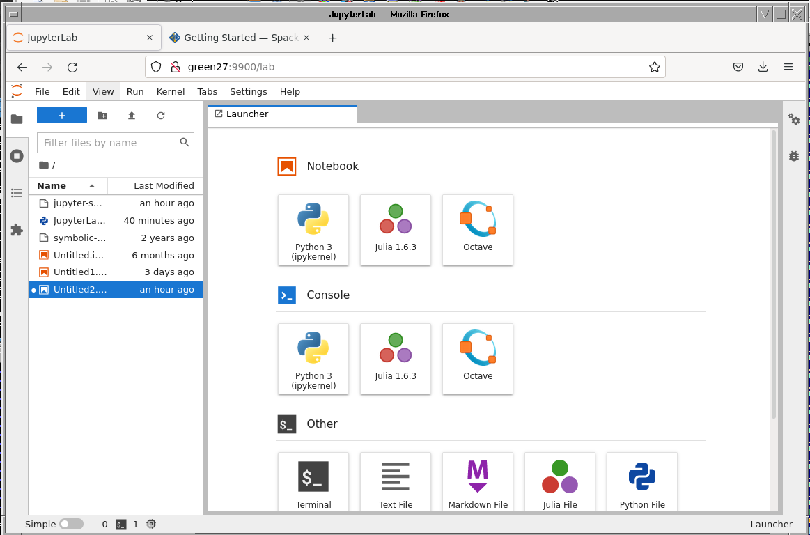

# JupyterLab

JupyterLab is an interactive notebook environment (with a web-browser interface) for Julia, Python, Octave and R.

 

## JupyterLab Short introduction

---

1. Download [jupyterlab.slurm](jupyterlab.slurm.txt) or  [jupyterlab-gpu.slurm](jupyterlab-gpu.slurm.txt) batch script:
    
        #!/bin/bash
        #SBATCH --nodes 1
        #SBATCH --ntasks 1
        #SBATCH --time 01:30:00
        # #SBATCH -p gpu                #uncomment if needed
        # #SBATCH --gres=gpu:1          #uncomment if needed
        
        #Load Python modules
        module load rocky8-spack/
        module load r
        module load julia
        module load octave
        module load py-jupyterlab
        module load py-pip
        # module load cuda              #uncomment if needed

        module list
        echo $SLURM_JOB_NODELIST

        #Create Jupyter conf
        cat << EOF > JupyterLab.conf.py
        # Set ip to '*' to bind on all interfaces
        c.NotebookApp.ip = '*'
        c.NotebookApp.open_browser = False

        # It is a good idea to set a known, fixed port for server access
        c.NotebookApp.port = 9900
        EOF

        #jupyter-lab --no-browser
        jupyter-lab --no-browser --config=JupyterLab.conf.py

        #Remove jupyter conf
        rm JupyterLab.conf.py

2. Submit the job on base

       ssh uni-ID@base.hpc.taltech.ee
       sbatch jupyterlab.slurm

3. Check the `slurm-JOBID.out` file for the URL, host and port to connect to.
**NB!** Text in `slurm-JOBID.out` can appear with some delay. 

4. Close terminal and establish a new connection to base with port forwarding

       ssh uni-ID@base.hpc.taltech.ee -L 99YY:greenX:99YY

5. Point your webbrowser to the URL from the `slurm-JOBID.out`, e.g.

       http://green1:9900/lab?token=6ddef678a64245352e74fc66987d378ce075f390d89a2c7f
    
*NB: Node name (green1 in the above example), port (here 9900) and token will be different for each job you submit! More detais can be found in Accessing Jupyter webinterface part.*

 

## JupyterLab on Taltech HPC (long version)

---

### Network access to TalTech HPC

In order to access the HPC head-node base.hpc.taltech.ee you have to use some Estonia network or VPN. 
TalTech [OpenVPN](<https://wiki.itcollege.ee/index.php/TalTech_VPN>) can be used for access outside of Estonia network. 

### Copy the SLURM start script to HPC head node

#### 1. Command line solution

Open command prompt.
On Linux and mac open any terminal app,
On Windows open PowerShell app (preferred) or Command Prompt app.
Log into HPC head-node with SSH client (UniID - your UniID, usually six lower letter string):

    ssh uni-ID@base.hpc.taltech.ee
    mkdir Jupyter  #Create folder for your Jupyter
    exit  

Copy the sbatch script [jupyterlab.slurm](jupyterlab.slurm) (for SLURM queuing system) to your newly created Jupyter folder in HPC. 
***NB!*** The file jupyterlab.slurm must be in the same folder where you execute the copy command
Copy with sftp:

    sftp uni-ID@base.hpc.taltech.ee:Jupyter/
    put local/path/from/where/to/copy/jupyterlab.sh 

Copy with scp:

    scp local/path/from/where/to/copy/jupyterlab.sh uni-ID@base.hpc.taltech.ee:Jupyter/ 

#### 2. GUI solution
Download sftp capable file transfer software.
For example, [WinSCP](https://winscp.net/eng/index.php) (Windows) or [FileZilla Client](https://filezilla-project.org/) (any platform).
Install sftp client, connect to base.hpc.taltech.ee, make your work directory and copy the[jupyterlab.slurm](jupyterlab.slurm) file. More details about using WinSCP and FileZilla Client can be found [here](https://docs.hpc.taltech.ee/quickstart.html#quickstart-cluster).

### Starting JupyterLab as batch job in HPC
If necessary start [VPN connection](https://confluence.ttu.ee/it-info/it-arvuti-ja-oppetoeoekoht/kauguehendus-vpn/kaugtoeoeuehendus-eduvpn).
Open terminal and ssh to HPC:

    ssh uni-ID@base.hpc.taltech.ee

Change directory to Jupyter project folder and start JupyterLab as a batch job:

    cd Jupyter
    sbatch jupyterlab.slurm

Then the system will say:
Submitted batch job JOBID 
were JOBID is unique number of a submitted job.

You can check whether the job runs, waits in the queue or has finished with a command: 
`squeue -u $uni-ID`. It gives you information about the job status, on which machine it runs, how long has it worked etc. 

As a default behavior submitted job standard output will be written into file slurm-JOBID.out.

If you need to stop and remove the job this can be done with command `scancel JOBID`.

### Values in jupyterlab.sh SLURM batch job script
Values concerning queuing system SLURM:

    #SBATCH --time 01:30:00 #Max runtime of the job, int this exampe 1 hour 30 minutes
    #SBATCH --ntasks 1  #Number of cores
    #SBATCH --nodes 1 #job must run on one node

Jupyter specific:

    c.NotebookApp.port = 9900 # The port where Jupyter can be accessed

If the specified port is occupied then the Jupyter takes next available port. The actual port number is shown in slurm output file.

### Accessing Jupyter webinterface
You have to create ssh tunnel. Enter into terminal:

    ssh uni-ID@base.hpc.taltech.ee -L 99YY:greenX:99YY 

Where "99YY" is port number of the Jupyter web server and "greenX" is the name of the node where the Jupyter job runs.  The port YY and compute node X name must be replaced with the actual values. 
These values are in the SLURM out file (unique to the running job). 
To check the content of SLURM out file more or less command can be used:

    less slurm-JOBID.out

***NB!*** To quit `less` press `q`.

In the end part of the file looks something like:
    
    To access the server, open this file in a browser:
        file:///gpfs/mariana/home/.......
    Or copy and paste one of these URLs:
        http://green27:9900/lab?token=6ddef678a64245352e74fc66987d378ce075f390d89a2c7f
     or http://127.0.0.1:9900/lab?token=6ddef678a64245352e74fc66987d378ce075f390d89a2c7f

In this example port number is 9901 and compute name is green27. So you have to replace these values in the tunneling command presented above. The command will look now:

    ssh uni-ID@base.hpc.taltech.ee -L 9901:green27:9901 

If your tunnel is running (ssh connection is active) then the JupyterLab can be accessed from the address:

    http://127.0.0.1:9901/lab?token=4046f45de18c9523525ed8d972d48618ee333c6417e640f6

Open the above presented address in your browser. 
***NB!*** These values are unique and different during each run. 

 

## with the new SPACK-based modules

---

The following modules need to be loaded to activate Julia, Octave and Python 3.8.12 in JupyterLab

        module load rocky8-spack/
        module load r
        module load julia
        module load octave
        module load py-jupyterlab
        module load py-pip
        
        
### First time only, prepare non-python kernels

Do the following in the command-line on base.

For julia (start julia and add package):

    julia
    ]
    add IJulia

For Octave:

    python -m pip install --user octave_kernel

then proceed as above (in the non-SPACK case, but change the module lines in the .slurm script)

<!---
For R:

    R
    install.packages("devtools",lib=paste(Sys.getenv("HOME"),"/.R/library",sep=""),repos="http://cran.r-project.org")
    R
    install.packages("codetools",lib=paste(Sys.getenv("HOME"),"/.R/library",sep=""),repos="http://cran.r-project.org")
    install.packages("IRkernel",lib=paste(Sys.getenv("HOME"),"/.R/library",sep=""),repos="http://cran.r-project.org")
    IRkernel::installspec()
--->

 

## Jupyter-notebooks as non-interactive jobs

---

Jupyter notebooks can be run non-interactive from the command-line using 

-    the buildin `nbconvert`

         jupyter nbconvert --to notebook --inplace --execute mynotebook.ipynb -ExecutePreprocessor.timeout=None

     you can also create a PDF from the notebook, by running

         jupyter nbconvert --to PDF --execute mynotebook.ipynb -ExecutePreprocessor.timeout=None

-    the `papermill` package

         papermill mynotebook.ipynb mynotebook_output.ipyn [args...]
     
     papermill makes it possible to pass parameters, e.g. setting start and end variables

         papermill mynotebook.ipynb mynotebook_output.ipyn -p start "2017-11-01" -p end "2017-11-30"

