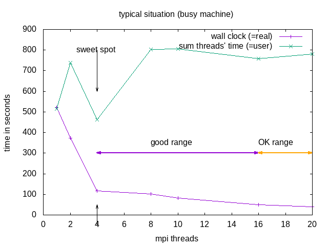

# OpenFOAM

 

## Quick-start: Example use of OpenFOAM on BASE cluster

---

For the example we will use one of the tutorial cases.

1. Load environment:
    
		module load rocky8-spack
		module load openfoam

2. First time users need to create their `$WM_PROJECT_USER_DIR`:

		export WM_PROJECT_USER_DIR=$HOME/OpenFOAM/$USER-$WM_PROJECT_VERSION
		mkdir $WM_PROJECT_USER_DIR --parent

3. Copy the damBreak tutorial case into the `$WM_PROJECT_USER_DIR` and go into the folder damBreak:

		cp -r $FOAM_TUTORIALS/multiphase/interFoam/laminar/damBreak/damBreak $WM_PROJECT_USER_DIR/
		cd $WM_PROJECT_USER_DIR/damBreak
		pwd

4. Now we can run the OpenFOAM case step-by-step or as a batch job.

	    srun --partition=common -t 2:10:00 -−pty bash
	    blockMesh
	    setFields
	    interFoam

***NB:*** Do **not** use the `Allrun` script(s) of the tutorials, as these may try to launch parallel jobs without requesting resources.

5. Visualize the results (create `case.foam` file to load in ParaView):

		touch case.foam
		paraview

6. Open `case.foam` in ParaView.

### Interactive single process

For a non-parallel run of the tutorial case, the `decomposeParDict` needs to be removed from `system` directory:

    mv system/decomposeParDict system/decomposeParDict-save

Running the damBreak case step-by-step interactively:

    module load rocky8-spack
    module load openfoam
    
    srun --partition=common -t 2:10:00 -−pty bash 
    blockMesh
    setFields
    interFoam

### Batch-job (non-interactive) parallel job

Alternatively, we can run the job in parallel as a batch job
(if you removed/renamed the `decomposeParDict` before, copy  it back by command): 

	cp system/decomposeParDict-save system/decomposeParDict

The `openfoam.slurm` script:

    #!/bin/bash -l
    
    #SBATCH -n 4
    #SBATCH -t 00:10:00  
    #SBATCH -J openfoam-damBreak
    #SBATCH --partition=green-ib
    
    #the following 2 lines are only needed if not done manually in command-line
    #before submitting the job
    module load rocky8-spack
    module load openfoam
    
    blockMesh
    decomposePar
    setFields
    srun interFoam -parallel
    reconstructPar

<!--   
 
 

## Which module and which node to use?

---

Here are timings for the `simpleFoam` solver with the motorBike case on empty nodes:

Empty nodes:

| module\ node | green (empty) | gray (empty) | green (full) |
|--------------|---------------|--------------|--------------|
| openfoam-v1912 | 16m0.781s | 20m30.122s | 40m15.321s |
| spack-green | 15m18.835s | - | 37m17.363s | 
| spack-gray | 15m18.537s | 19m8.511s | 37m53.517s |

Surprisingly, the timing between the different modules is not much different. However, on full nodes we experienced a significant difference to the empty nodes.
This is probably due to two reasons, full nodes cannot run on boost-clock-frequency and there may be congestion of the memory lanes. A Xeon Skylake CPU has only 6 memory lanes to be shared by 20 cores. If a memory intensive application is on the other cores, this may cause a slow-down.
-->

 
 

## Pre-processing (geometry and mesh generation)

---

The geometry and mesh can be either hand-coded using **blockMesh** or with **Gmsh**, **FreeCAD** or **Salome**. When using Gmsh, be sure to save the mesh in v2 ASCII format (see separate page on [CAD-mesh](cad-mesh.md). This creates a volume mesh.

To convert a Gmsh volume `.msh` file for OpenFOAM, use

    gmshToFoam meshfile.msh

Another possibility is to use CAD for a surface mesh and use the snappyHexMesh utility to adapt a blockMesh volume mesh to the surface (see OpenFOAM motorcycle tutorial).

 
 

## Visualizing the results (post-processing)

---

1. Login to **viz** (manual can be found [here](../visualization.md)).
2. Change to the case directory.
3. Create an empty `.foam` file for the case:

		touch damBreak.foam

4. then use the regular ParaView:

    	paraview

5. Open the `.foam` file from the menu.

 
 

## Comparison of the execution time

---

It is educational to check the runtime of the code using the `time` command, e.g. for the single-thread

    time interFoam

and for the parallel run (in the `openfoam.slurm` script)

    time mpirun -n $SLURM_NTASKS interFoam -parallel

As the damBreak case is quite small, it is likely that the parallel run is not faster than the sequential, due to the communication overhead.

In a testrun, the resuls have been as follows:

| time type | sequential | parallel  |
|-----------|------------|-----------|
| real      |  0m8.319s  | 0m39.463s |
| user      |  0m6.927s  | 1m1.755s  |
| sys       |  0m0.432s  | 0m2.922s  |

**Lesson to be learned:** Parallel computation is only useful for sufficiently large jobs.

**NOTE: Parallel does not (necessarily) mean faster!!!** Parallel execution introduces overhead (starting threads, communication)! For optimal execution time and optimal use of resources one needs to test and find the sweet spot.

The division into the areas is a combined decision taking into account "real" (wall clock) and "user" (summed time of all threads) time (from the `time` command). "Wall clock" (real) time is the time one needs to wait till the job is finished, "Summed thread time" (user) is the sum of the times that all individual threads needed, it should be roughly user = numtreads x real. For parallel programs, one can expect that "user" time of the parallel run is larger than for the sequential, due to communication overhead, if it is smaller, that probably means the individual threads could make better use of cache.

| area | why | explanation |
|-----------|------------|-----------|
| sweet spot | minimal "user" time | = minimal heat production, optimal use of resources |
| good range | linear speedup for "real", with constant or slightly increasing "user" | |
| OK range | slightly less than linear speedup for "real", and slightly increasing "user" | |
| avoid | ascending slope in the diagram for "real" and "user" | one actually needs to wait longer compared to the case with fewer cores |

Recommended in *this* case would be to request 8 threads `-n 8 --ntasks-per-node 8` but use `mpirun -n 4`. OpenFOAM does not seem to benefit from hyperthreading.

 
 

## Some errors and how to solve them

---

- "slurmstepd: error: Detected 1oom-kill event(s) in ": this is a SLURM out-of-memory error: solve by increasing the memory request `--mem=xxGB` where xx is something larger than before
- a "Bus error" means the software tries to access non-existing memory, this is actually a SLURM out-of-memory error: solve by increasing the memory request `--mem=xxGB` where xx is something larger than before
- infiniband error: wrong partition, the nodelist contains non-infiniband nodes; or wrong openmpi module
- 
