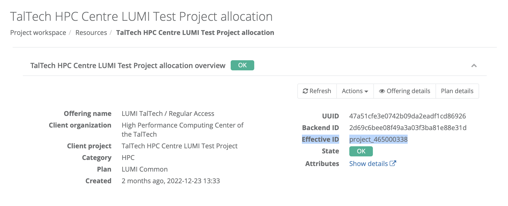
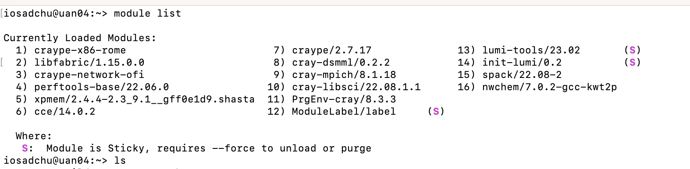

# Programs on LUMI

LUMI offers a wide range of programs in different fields:

- Machine learning on top of PyTorch and Tensorflow
- Image classification - ResNet
- Object recognition and XFMR translation - SSD, XFMR
- Scientific software suites - Gromacs (molecular dynamics), CP2K (quantum chemistry) and ICON (climate science)
- Weather prediction  application - GridTools allowing  measures stencil-based
- etcetera

 

More information about installed software and how to install software yourself can be found in the [LUMI documentation](https://docs.lumi-supercomputer.eu/software/).

The list of available programs can be found in [LUMI Software Library](https://lumi-supercomputer.github.io/LUMI-EasyBuild-docs/). There can be also found license information - whether the program is free to use, requires pre-registration, or the user must provide own license. 

 
 

## First time use

---

To be able to use a program user has first to install it. Installation can be done by **spack** or by **EasyBuild**. The list of available programs in **EasyBuild** can be found in [LUMI Software Library](https://lumi-supercomputer.github.io/LUMI-EasyBuild-docs/) as well as installation instructions. List of programs which can be installed by **spack** can be looked by `spack list` command. The same program can be installed by both **spack** and **EasyBuild**.

There are two possible places where programs can be installed - user's `$HOME` or project directory. The latest is recommended, sines other user of the project will be able to use installed programs as well. Moreover `$HOME` size is limited by 20GB. More about [data storage at LUMI](https://docs.lumi-supercomputer.eu/storage/#where-to-store-data) and [storage billing](https://docs.lumi-supercomputer.eu/runjobs/lumi_env/billing/#storage-billing).

Project `XXX` number can be found in [ETAIS](https://etais.ee) as `Effective ID`.

 

It is a good practice to add place, where programs will be installed into your .profile or .bashrc file. To do this give a command:

	echo  "export EBU_USER_PREFIX=/project/project_XXX" >> .bashrc

where `XXX` is a project number.

To install programs into use the following commands:

	export EASYBUILD PREFIX=$HOME/easybuild 
	export EASYBUILD BUILDPATH=/tmp/$USER

 
 
 

## Program installation

---

### Installation by Spack 

1. Initialize **spack**:

		export SPACK_USER_PREFIX=/project/project_XXX/spack 
		module list

	where project `XXX` number can be found in [ETAIS](https://etais.ee) as `Effective ID`. 

	after user should load the following modules:

		module load LUMI/YYY  partition/ZZZ 
		module load spack/RRR
 
	where `YYY`  - version of LUMI, will appear in module list.  
 	Partition `ZZZ` is determined depending on CPUs (partition/C) or GPUs (partition/G) will be used.  
	`RRR` - version of **spack**, will appear in the module list. 

	

2. The entire list of programs available for installation by **spack**, can be viewed by command:

		spack list

	The list will be too long, so better to search for certain program by command:

		spack list program_name

	where the whole name or part of it is given.

	**NB!** **spack** is insensitive to caps.

3. Check what flags should be added: 

		spack info program_name

	

3. Program installation is made by command:

		spack install program_name@version%compiler@version +flag(s) ^forced_dependencies

	where `flag` is an installation options taken from variants of **spack** info see above. It is recommended to try the `cce` (Cray Compiler Edition) and for MPI dependent software to force the `cray-mpich` dependency.
	
	for example:
	
		spack install nwchem@7.0.2%cce@15.0.1 +openmp ^cray-mpich@8.1.25
	
	or 

		spack install kokkos+rocm+debug_bounds_check amdgpu_target=gfx90a %gcc@11.2.0
        
        Refresh the module list

                spack module tcl refresh -y
        
	For more details see [LUMI guide](https://docs.lumi-supercomputer.eu/software/installing/spack/).

	***NB!***  _Program installation will require time up to hours._

4. When program is already installed user should load it before use by commands:

	 	module load program_name

 

### Installation by EasyBuild 

1. To install program with **EasyBuild**, initialise it by following commands:

		module use /projappl/project_XXXX/easybuild/modules/all
		module list

	where project `XXX` number can be found in [ETAIS](https://etais.ee) as `Effective ID`. 

	after user should load the following modules:

		module load LUMI/YYY  partition/ZZZ 
		module load EasyBuild-user
 
	where `YYY` - version of LUMI that can be found at program's page in [LUMI Software Library](https://lumi-supercomputer.github.io/LUMI-EasyBuild-docs/).  
	Sometimes partition `ZZZ` is determined in the description of the program in [LUMI Software Library](https://lumi-supercomputer.github.io/LUMI-EasyBuild-docs/). In case it is not, partition `ZZZ` is used depending on CPUs (partition/C) or GPUs (partition/G) will be used.

	

2. After EasyBuild is loaded user can install the program needed by command `eb`.

		eb `program_eb_file`

	***NB!*** _The full name of `program_eb_file` as well as some additional flags needed for installation can be found at program's page in [LUMI Software Library](https://lumi-supercomputer.github.io/LUMI-EasyBuild-docs/)._

	***NB!*** _Program installation will require time up to an hour._

3. When program is already installed user should load it before use by commands:

	 	module load program_name

 
 

## Loading program & adding modules into slurm

---

When program is already installed, user should load it before use or add into slurm script. If program was installed by **spack** the following commands should be given:

	export SPACK_USER_PREFIX=/project/project_XXX/spack
	module load LUMI/YYY  partition/ZZZ 
	module load spack/YYY
	module load program_name/VVV

where `XXX` is a project number, and can be found in [ETAIS](https://etais.ee) as `Effective ID`.
`YYY`  - version of LUMI, will appear in module list.  
Partition `ZZZ` is determined depending on CPUs (partition/C) or GPUs (partition/G) will be used.  
`RRR` - version of **spack**, will appear in the module list.
`VVV` - version of program, will appear in the module list.

if programs was installed by **EasyBuild** the following commands should be given:

	module use /projappl/project_465000338/easybuild/modules/all
	module load LUMI/YYY  partition/ZZZ 
	module load EasyBuild/
	module load program_name/VVV

where `XXX` is a project number, and can be found in [ETAIS](https://etais.ee) as `Effective ID`.
`YYY`  - version of LUMI, will appear in module list.  
Partition `ZZZ` is determined depending on CPUs (partition/C) or GPUs (partition/G) will be used.  
`RRR` - version of **spack**, will appear in the module list.
`VVV` - version of program, will appear in the module list.

Examples of slurm scripts can be found [here](https://docs.lumi-supercomputer.eu/runjobs/scheduled-jobs/slurm-quickstart/).

 
 

## Uninstalling programs

---

