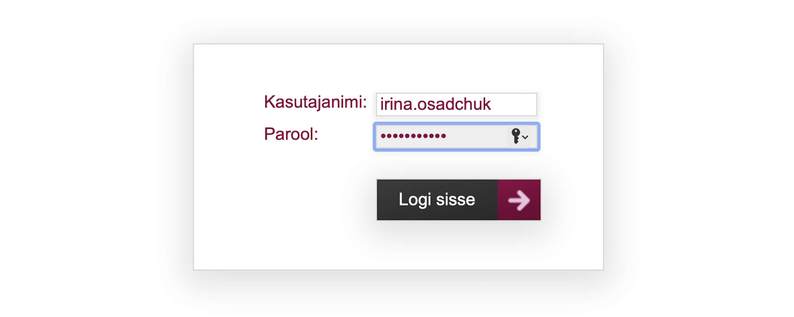
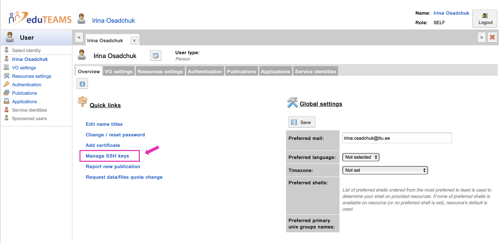

# LUMI

 

## Getting Started on LUMI

---

***If you face any problems during registration to LUMI give us know by email "hpcsupport@taltech.ee" or in Teams in  "HPC Support Chat".***  
 

1. Login to [minu.etais.ee](https://minu.etais.ee/login/) with MyAccessID.

	
 	

	

	

2. Choose your affiliation (ttu.ee)

	
 

	

	

3. Identify yourself with **Uni-ID (six letters taken from the user’s full name),** but for longtime employees it could be name.surname. 

	
 
	
	

	

4. Agree with all propositions and press button to continue.  

	
 
	
	

	

5. After notification of successful account creation **you need to open a new tab** and go to [mms.myaccessid.org](https://mms.myaccessid.org/profile/).  

	

    After filling in fields needed and agreement with use policy and terms of use, press button **"Submit".**

6. Register your SSH key in MyAccessID. To do this click to `Manage SSH key`. 

	

	Then add your SSH key into corresponding field. In Linux and Mac public SSH key can be found in `.ssh/id_rsa.pub` file. Windows by default saves public SSH key at `C:\Users\your_username/.ssh/id_rsa.pub`. How to generate SSH keys can be found [here](../ssh.md).

	

	It is important to add your SSH key immediately after account creation, since this SSH key will be automatic transfer to LUMI and used for user authentication during first and subsequent connection to LUMI.

7. If **you are a project leader** -- Contact to Resource Allocator (`hpcsupport@taltech.ee`). HPC Centre will add LUMI resources to your account. If name of the project is already known add it as well.    If **you are a team member,** -- contact your project leader (or course teacher) to be added to a project.
	
	***NB!*** _Just adding HPC-LUMI resources to an existing project will not work._

5. After you receive an answer from HPC Centre, login to [minu.etais.ee](https://minu.etais.ee/) account.

6. The corresponding project appears in your ETAIS account.  

	

6. In short time you will receive a letter from `info-noreply@csc.fi` where you will be given your user name for LUMI.

7. Try to connect to LUMI with received user name by the command:
	
		ssh LUMI-user-name@@lumi.csc.fi

	***NB!*** _Synchronization may take some time, so if you have problems with connection with SSH key, it should wait longer and try again._

8. Read the documentation on the LUMI homepage [https://docs.lumi-supercomputer.eu/firststeps/getstarted/](https://docs.lumi-supercomputer.eu/firststeps/getstarted/). Especially check the different filesystems and their prices, since LUMI charges TB/hour, as well as the guide for containerization of python environments (pip, conda).

