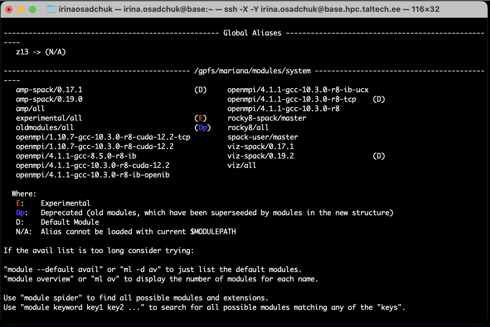
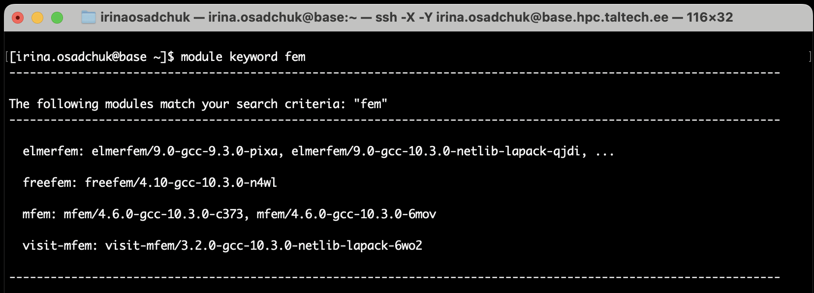
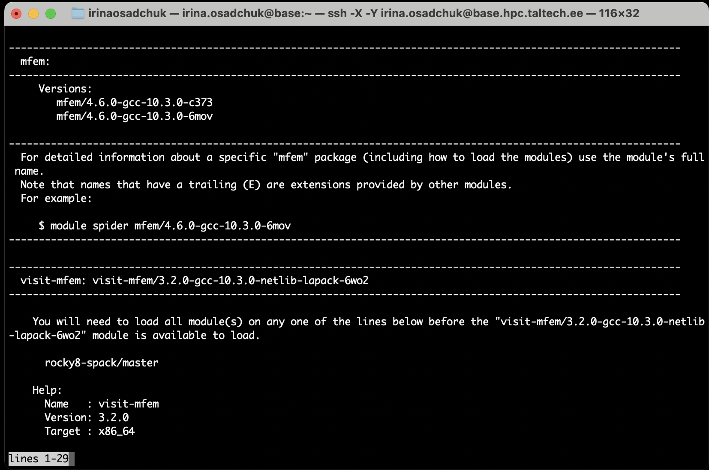
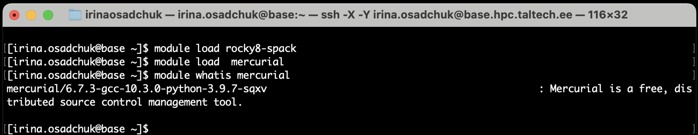

# Module environment (lmod)

 

## Short introduction 

---

HPC has a module step-system. To use some application, user needs to follow these two steps, and insert applications into the search path:

1. Determine the machine type (eg. amp or green) by command:

       module load rocky8-spack      # for most free programs (SPACK package manager) 
    
    or
    
       module load rocky8/all        # for licensed programs and some free (non-SPACK managed)
       
2. Load program needed:

       module load tau

The list of avalible modules can be looked by:

    module avail
       
where:  

_**Lic**   - a license is required, see user-guide for more information_  

_**Uni**   - commercial software with site licence, number of concurrent processes may be limited_  
 
_**Reg**   - registration required, see user-guide for more information_  

_**L**    -  module is loaded_
  
_**Dp**   - deprecated (old modules, which have been superseeded by modules in the new structure)_
  
_**O**    - obsolete (module moved or superseeded by SPACK module)_  

_**Exp**    - Experimental module, used while testing software installation, module name may change or software may be deleted_  
_**D** - default Module._

 
 

## Long version 

---

The module system is used to manage settings for different applications. Many applications and libraries are not in the standard search path, this way it is possible to install two different versions of the same software/library that would otherwise create conflicts. The module system is used to insert applications into the search path (or remove them from it) on a per user and per occasion basis.

### Useful commands

 - All available modules can be looked through by command:

       module avail

    example output:

    
 

    

    

        

    modules are grouped in a hierarchy, there may be several versions of the same software installed, e.g. of the MPI library. Only one of these can be loaded at a single time. The default module of a group is marked by the `(D)`, if there is only one module in a group this is the default (unmarked).

 - To load a certain version of a module/program _(here - Open MPI 4.1.1-gcc-8.5.0-r8-ib)_:

       module load openmpi/4.1.1-gcc-8.5.0-r8-ib 

    To load the default module/program marked `(D)` _(here - Open MPI 4.1.1-gcc-10.3.0-r8-tcp)_:

       module load openmpi/

 - To list all loaded modules

       module list        

 - Unloading a module _(here - Cuda 11.3.1-gcc-10.3.0-ehi3)_:

       module unload cuda/11.3.1-gcc-10.3.0-ehi3

 -  Finding a module containing a certain part _(here - fem)_:

        module keyword fem

    Will be listed all modules that have _"fem"_ in the description:

    
 

    

    

 - To find out more about a specific module _(here - mfem)_:

       module spider mfem

    gives

    
 

    

    

 - The `module whatis` command gives you a short explanation what the software is about, e.g.

    
 

    

    

    or

    
 

    

    

 

###  Files .modulerc.lua and .bashrc

Personal preferences and resources can be specified in the files `.modulerc.lua` and  `.bashrc` in the user's `$HOME` directory. For example, it is possible to add a path for own module files for software installed by the user in the user's `$HOME` directory, 
automatically load some modules on login and to define one's own "default" modules using the entry "module_version("r/4.1.1-gcc-10.3.0-zwgc","default")" or introduce abbreviations using an entry like "module_alias("z13", "r/4.1.1-gcc-10.3.0-zwgc")" to define a module alias "z13".

examplele of `.modulerc.lua` file

    module_version("r/4.1.1-gcc-10.3.0-zwgc","default")
    module_alias("z13","r/4.1.1-gcc-10.3.0-zwgc")

    module_version("p/20.2-gcc-10.3.0-python-2.7.18-ij2m","default")
    module_alias("p20","p/20.2-gcc-10.3.0-python-2.7.18-ij2m")
    
examplele of `.bashrc` file
    
    # .bashrc

    # Source global definitions
    if [ -f /etc/bashrc ]; then
        . /etc/bashrc
    fi

    # Uncomment the following line if you don't like systemctl's auto-paging feature:
    # export SYSTEMD_PAGER=

    # User specific aliases and functions
    module load rocky8-spack
    module load r/4.1.1-gcc-10.3.0-zwgc

 
  

## Module groups

---

We moved to a new module structure! Modules from `/share/apps/modules` are being retired. Software is compiled for `x86-64` and will run o all nodes (no special optimization). Optimized versions for some software for specific nodes may follow later (or not).

New modules are grouped, you can activate them by loading one or more of the following modules:

| modulegroup | description |
|-------------|-------------|
| rocky8/all   | manually installed software |
| rocky8-spack | software installed with spack package manager |

 
  

## Modules used on **viz**

---

In order to make the module system work on **viz**, the following needs to be added to your `$HOME/.bashrc`

    if  [[ $(hostname -s) = viz ]]; then
       source /usr/share/lmod/6.6/init/bash
       module use /gpfs/mariana/modules/system
    fi

Further access to **viz** and load modules needed. For example:

    ssh -X -A -J UNI-ID@base.hpc.taltech.ee   UNI-ID@viz.hpc.taltech.ee

    module load viz-spack
    module load jmol

More about use of **viz** can be found at [visualization page](visualization.md).

 
  

## Available modules

---

Currently the following modules are available, this serves as an example, please note that the list on this page will be updated very seldom, use `module avail` after login to get an up-to-date list of the availabe modules.

Click to expand

    
    ---------------------- /gpfs/mariana/modules/rocky8/all -----------------------
       abaqus/2018                       (Uni)
       abaqus/2021                       (Uni,D)
       abcl/1.9.2
       ansys-autodyn/23.2                (Lic,E)
       ansys-fluids/23.2
       gaussian/09
       gaussian/16.c01
       gaussian/16.c02
       gaussian/16                       (D)
       gaussview/6.1
       lsdyna/intel-mpp-13.0.0-d         (Lic)
       lsdyna/intel-mpp-13.0.0-s         (Lic)
       lsdyna/smp-13.0.0-d               (Lic)
       lsdyna/smp-13.0.0-s               (Lic,D)
       matlab/2014b                      (Uni)
       matlab/2018a                      (Uni)
       matlab/2021b                      (Uni)
       matlab/2022b                      (Uni)
       matlab/2023b                      (Uni,D)
       orca/4.1.2-lic
       orca/4.1.2
       orca/5.0.4                        (D)
       sbcl/2.2.2                        (L)
       star-ccm+/15.06.007-r8            (Lic)
       star-ccm+/15.06.008-r8            (Lic)
       star-ccm+/16.04.007-r8
       star-ccm+/16.04.012-r8            (Lic)
       star-ccm+/17.02.008-r8            (Lic)
       star-ccm+/17.04.008-r8-cad-nx-con (Lic)
       star-ccm+/17.04.008-r8            (Lic)
       star-ccm+/17.06.007-r8            (Lic)
       star-ccm+/18.04.008-r8            (Lic)
       star-ccm+/18.04.009-r8            (Lic,D)
       stda/1.6.3
       vmd/1.9.3-text                    (Reg,L)
    
    
    ----------------- /gpfs/mariana/modules/rocky8/rocky8-x86_64 ------------------
       bcftools/1.19-gcc-10.3.0-openblas-2nph
       bioawk/1.0-gcc-10.3.0-xzhf
       chapel/1.24.1-gcc-10.3.0-kryx
       cmake/3.29.2-gcc-10.3.0-jsyg
       cuda/11.3.1-gcc-10.3.0-ehi3
       cuda/12.2.2-gcc-10.3.0-5rec                                 (D)
       curl/8.7.1-gcc-10.3.0-xdf5                                  (L)
       elmerfem/9.0-gcc-10.3.0-4uqn
       fastqc/0.12.1-gcc-10.3.0-56yh
       fftw/3.3.10-gcc-10.3.0-ccxe
       freefem/4.10-gcc-10.3.0-n4wl
       gawk/5.3.0-gcc-8.5.0-a7a3
       gcc/10.3.0-gcc-8.5.0-abqv                                   (L)
       git/2.45.1-gcc-10.3.0-5xxc
       glib/2.78.3-gcc-10.3.0-on3e
       gnuplot/6.0.0-gcc-10.3.0-lysd
       gperf/3.1-gcc-10.3.0-ogys
       gromacs/2024.2-gcc-10.3.0-gqvn
       hdf5/1.14.3-gcc-10.3.0-pkxk
       hypre/2.31.0-gcc-10.3.0-kpoh
       jmol/14.31.0-gcc-10.3.0-wajs
       julia/1.10.2-gcc-10.3.0-openblas-a6d4
       libcatalyst/2.0.0-gcc-10.3.0-openblas-vpu7
       libfabric/1.18.0-gcc-10.3.0-qtmt
       lmod/8.7.37-gcc-10.3.0-nprc
       mawk/1.3.4-20240123-gcc-10.3.0-dw6a
       mercurial/6.7.3-gcc-10.3.0-python-3.9.7-sqxv
       mfem/4.6.0-gcc-10.3.0-c373
       mfem/4.6.0-gcc-10.3.0-6mov                                  (D)
       miniconda3/24.3.0-gcc-10.3.0-343s
       molden/6.7-gcc-10.3.0-5ln6
       netcdf-c/4.9.2-gcc-10.3.0-ergk
       netcdf-fortran/4.6.1-gcc-10.3.0-24g7
       netlib-lapack/3.11.0-gcc-10.3.0-5j7d
       netlib-scalapack/2.2.0-gcc-10.3.0-nvhpc-openmpi-frty
       nvhpc/22.9-gcc-10.3.0-c6t2
       nvtop/3.0.1-gcc-10.3.0-pure
       nvtop/3.0.1-gcc-10.3.0-v7ne
       nvtop/3.0.1-gcc-10.3.0-zq2a                                 (D)
       nwchem/7.2.2-gcc-10.3.0-netlib-lapack-klio
       octave-symbolic/2.9.0-gcc-10.3.0-netlib-lapack-24iy
       octave/9.1.0-gcc-10.3.0-netlib-lapack-tjlh
       openblas/0.3.26-gcc-10.3.0-khv7                             (L)
       openfoam-org/5.0-gcc-10.3.0-sblp
       openfoam-org/10-gcc-10.3.0-jhub                             (D)
       openfoam/1912_220610-gcc-10.3.0-j6wc
       openfoam/2106_220610-gcc-10.3.0-2jnl
       openfoam/2312-gcc-10.3.0-gclj                               (L,D)
       openrasmol/2.7.5.2-gcc-10.3.0-rnlx
       paraview/5.9.1-gcc-10.3.0-openblas-464b                     (L)
       petsc/3.21.1-gcc-10.3.0-netlib-lapack-lqid
       picard/3.1.1-gcc-10.3.0-madg
       py-anyio/3.6.2-gcc-10.3.0-python-3.9.7-bugc
       py-argon2-cffi-bindings/21.2.0-gcc-10.3.0-python-3.9.7-ir5u
       py-argon2-cffi/21.3.0-gcc-10.3.0-python-3.9.7-e3q4
       py-asttokens/2.4.0-gcc-10.3.0-python-3.9.7-7l43
       py-attrs/23.1.0-gcc-10.3.0-python-3.9.7-lytk
       py-babel/2.12.1-gcc-10.3.0-python-3.9.7-6e4r
       py-backcall/0.2.0-gcc-10.3.0-python-3.9.7-omya
       py-beautifulsoup4/4.12.2-gcc-10.3.0-python-3.9.7-3mbk
       py-bleach/6.0.0-gcc-10.3.0-python-3.9.7-jkow
       py-certifi/2023.7.22-gcc-10.3.0-python-3.9.7-u4vk
       py-cffi/1.15.1-gcc-10.3.0-python-3.9.7-njeq
       py-charset-normalizer/3.3.0-gcc-10.3.0-python-3.9.7-ahmd
       py-comm/0.1.4-gcc-10.3.0-python-3.9.7-tbis
       py-contourpy/1.0.7-gcc-10.3.0-openblas-nf6f
       py-cycler/0.11.0-gcc-10.3.0-python-3.9.7-5qo2
       py-debugpy/1.6.7-gcc-10.3.0-python-3.9.7-ixy4
       py-decorator/5.1.1-gcc-10.3.0-python-3.9.7-6o6k
       py-defusedxml/0.7.1-gcc-10.3.0-python-3.9.7-etbf
       py-executing/1.2.0-gcc-10.3.0-python-3.9.7-jb5a
       py-fastjsonschema/2.16.3-gcc-10.3.0-python-3.9.7-2tkd
       py-fonttools/4.39.4-gcc-10.3.0-python-3.9.7-zbrq
       py-gevent/23.7.0-gcc-10.3.0-python-3.9.7-ywdo
       py-greenlet/2.0.2-gcc-10.3.0-python-3.9.7-g3wh
       py-idna/3.4-gcc-10.3.0-python-3.9.7-xfuj
       py-importlib-metadata/7.0.1-gcc-10.3.0-python-3.9.7-phev
       py-importlib-resources/5.12.0-gcc-10.3.0-python-3.9.7-zc5z
       py-ipykernel/6.23.1-gcc-10.3.0-openblas-ejda
       py-ipython-genutils/0.2.0-gcc-10.3.0-python-3.9.7-7tjr
       py-ipython/8.14.0-gcc-10.3.0-openblas-cevj
       py-jedi/0.18.2-gcc-10.3.0-python-3.9.7-owt3
       py-jinja2/3.1.2-gcc-10.3.0-python-3.9.7-ejri
       py-json5/0.9.14-gcc-10.3.0-python-3.9.7-setp
       py-jsonschema/4.17.3-gcc-10.3.0-python-3.9.7-5bd3
       py-jupyter-client/8.2.0-gcc-10.3.0-python-3.9.7-wexx
       py-jupyter-core/5.3.0-gcc-10.3.0-python-3.9.7-wld5
       py-jupyter-server/1.21.0-gcc-10.3.0-python-3.9.7-b25c
       py-jupyterlab-pygments/0.2.2-gcc-10.3.0-python-3.9.7-kttz
       py-jupyterlab-server/2.22.1-gcc-10.3.0-python-3.9.7-ryk3
       py-jupyterlab/3.4.2-gcc-10.3.0-openblas-xsvk
       py-kiwisolver/1.4.5-gcc-10.3.0-python-3.9.7-yygr
       py-markupsafe/2.1.3-gcc-10.3.0-python-3.9.7-bpul
       py-matplotlib-inline/0.1.6-gcc-10.3.0-openblas-o5z6
       py-matplotlib/3.8.4-gcc-10.3.0-openblas-6vmn
       py-mistune/2.0.5-gcc-10.3.0-python-3.9.7-eid7
       py-nbclassic/0.4.8-gcc-10.3.0-openblas-zx6b
       py-nbclient/0.8.0-gcc-10.3.0-python-3.9.7-b7xq
       py-nbconvert/7.14.1-gcc-10.3.0-python-3.9.7-hxvg
       py-nbconvert/7.14.1-gcc-10.3.0-python-3.9.7-y6ii            (D)
       py-nbformat/5.8.0-gcc-10.3.0-python-3.9.7-74ab
       py-nest-asyncio/1.5.6-gcc-10.3.0-python-3.9.7-4hdc
       py-notebook-shim/0.2.3-gcc-10.3.0-python-3.9.7-w5cs
       py-numpy/1.21.6-gcc-10.3.0-openblas-kaao
       py-packaging/23.1-gcc-10.3.0-python-3.9.7-bzma
       py-pandocfilters/1.5.0-gcc-10.3.0-python-3.9.7-uitt
       py-parso/0.8.3-gcc-10.3.0-python-3.9.7-qxxb
       py-pexpect/4.8.0-gcc-10.3.0-python-3.9.7-wwkw
       py-pickleshare/0.7.5-gcc-10.3.0-python-3.9.7-xyrl
       py-pillow/10.3.0-gcc-10.3.0-python-3.9.7-spkd
       py-pip/23.1.2-gcc-10.3.0-python-3.9.7-pmrk
       py-platformdirs/3.10.0-gcc-10.3.0-python-3.9.7-7pms
       py-prometheus-client/0.17.0-gcc-10.3.0-python-3.9.7-ajdv
       py-prompt-toolkit/3.0.38-gcc-10.3.0-python-3.9.7-7733
       py-psutil/5.9.5-gcc-10.3.0-python-3.9.7-bxii
       py-ptyprocess/0.7.0-gcc-10.3.0-python-3.9.7-ubd4
       py-pure-eval/0.2.2-gcc-10.3.0-python-3.9.7-7e7k
       py-pybind11/2.12.0-gcc-10.3.0-python-3.9.7-yyzs
       py-pycparser/2.21-gcc-10.3.0-python-3.9.7-l633
       py-pygments/2.13.0-gcc-10.3.0-python-3.9.7-df5m
       py-pyparsing/3.1.2-gcc-10.3.0-python-3.9.7-ojnc
       py-pyrsistent/0.19.3-gcc-10.3.0-python-3.9.7-u6lp
       py-python-dateutil/2.8.2-gcc-10.3.0-python-3.9.7-uc6q
       py-pyzmq/25.0.2-gcc-10.3.0-python-3.9.7-vtzs
       py-requests/2.31.0-gcc-10.3.0-python-3.9.7-evis
       py-send2trash/1.8.0-gcc-10.3.0-python-3.9.7-bgvz
       py-setuptools/59.4.0-gcc-10.3.0-python-3.9.7-mjeg
       py-six/1.16.0-gcc-10.3.0-python-3.9.7-pz4t
       py-sniffio/1.3.0-gcc-10.3.0-python-3.9.7-opfj
       py-soupsieve/2.4.1-gcc-10.3.0-python-3.9.7-oanu
       py-stack-data/0.6.2-gcc-10.3.0-python-3.9.7-nkn4
       py-terminado/0.17.1-gcc-10.3.0-python-3.9.7-zfq4
       py-tinycss2/1.2.1-gcc-10.3.0-python-3.9.7-ddln
       py-tornado/6.3.3-gcc-10.3.0-python-3.9.7-c7p3
       py-traitlets/5.9.0-gcc-10.3.0-python-3.9.7-r677
       py-typing-extensions/4.8.0-gcc-10.3.0-python-3.9.7-ql62
       py-urllib3/2.1.0-gcc-10.3.0-python-3.9.7-edpr
       py-wcwidth/0.2.7-gcc-10.3.0-python-3.9.7-tcwk
       py-webencodings/0.5.1-gcc-10.3.0-python-3.9.7-b533
       py-websocket-client/1.6.3-gcc-10.3.0-python-3.9.7-5po6
       py-zipp/3.17.0-gcc-10.3.0-python-3.9.7-5b4u
       py-zope-event/4.6-gcc-10.3.0-python-3.9.7-ffgp
       py-zope-interface/5.4.0-gcc-10.3.0-python-3.9.7-2q5a
       python/3.9.7-gcc-10.3.0-kxnt                                (L)
       qwt/6.1.6-gcc-10.3.0-vimf
       r/4.4.0-gcc-10.3.0-netlib-lapack-mvzt
       samtools/1.19.2-gcc-10.3.0-6l26
       screen/4.9.1-gcc-10.3.0-rzjc
       sortmerna/2017-07-13-gcc-10.3.0-3nqh
       star/2.7.11b-gcc-10.3.0-26bs
       su2/8.0.1-gcc-10.3.0-xdk6
       tmux/3.4-gcc-10.3.0-5b7i
       trimmomatic/0.39-gcc-10.3.0-qwqr
       vcftools/0.1.16-gcc-10.3.0-r5ch
    
    ------------------------ /gpfs/mariana/modules/system -------------------------
       amp-spack/0.17.1                       (D)
       amp-spack/0.19.0
       amp/all
       experimental/all
       oldmodules/all                         (Dp)
       openmpi/1.10.7-gcc-10.3.0-r8-cuda-12.2
       openmpi/4.1.1-gcc-8.5.0-r8-ib
       openmpi/4.1.1-gcc-9.3-amp
       openmpi/4.1.1-gcc-9.3-amppmi
       openmpi/4.1.1-gcc-9.3-amppmicuda11.4
       openmpi/4.1.1-gcc-10.3.0-r8-cuda-12.2  (L)
       openmpi/4.1.1-gcc-10.3.0-r8-ib-openib
       openmpi/4.1.1-gcc-10.3.0-r8-ib-ucx
       openmpi/4.1.1-gcc-10.3.0-r8-tcp
       openmpi/4.1.1-gcc-10.3.0-r8            (D)
       rocky8-spack/master                    (L)
       rocky8/all
       viz-spack/0.17.1
       viz-spack/0.19.2                       (D)
       viz/all

 

By default SPACK builds optimized for the CPU the software is build on.
The packages from the **amp** nodes will work on the **green** nodes but slower than the optimized modules. Conversely, the skylake-optimized modules will try to use hardware features not present on the **green** nodes, so the software will not run there.

<!---
You can autoactivate the correct module path in your `.bashrc` with a code block like this:

    if [[ $(hostname -s) = base ]]; then
      module load green
      module load green-spack
    elif [[ $(hostname -s) = green* ]]; then
      module load green
      module load green-spack
    elif  [[ $(hostname -s) = gray* ]]; then
      module load gray
      module load gray-spack
    elif  [[ $(hostname -s) = mem1tb ]]; then
      module load gray
      module load gray-spack
    elif  [[ $(hostname -s) = amp* ]]; then
      module use /gpfs/mariana/modules/system
      module load amp
      module load amp-spack
    elif  [[ $(hostname -s) = viz ]]; then
      source /usr/share/lmod/6.6/init/bash
      module use /gpfs/mariana/modules/system
    fi
--->

<!--
### _SPACK for user build software_

SPACK can also be used by users to manage their own software stack inside their home directory (be aware, this takes a lot of space!).

see documentation on <https://spack.readthedocs.io/en/latest/>

SPACK includes GPU-offloading compiler for both Nvidia and AMD, profiling tools (Tau, HPCToolkit) and engineering simulation packages (ElmerFEM, OpenFOAM).

SPACK is used by University of Tartu, LRZ and HLRS.
-->

<!--
## Software modules from the EasyBuild package system

**under development, docs AND module positions/versions may change without notice**

EasyBuild is a package manager to install software packages. An advantage is to be able to relatively easily install consistent dependencies and multiple versions of a software. [List of packages](https://docs.easybuild.io/en/latest/version-specific/Supported_software.html)

EasyBuild is available on **amp** from AI lab

    module load amp

### _EasyBuild for user build software_

EasyBuild can also be used by users to manage their own software stack inside their home directory (be aware, this takes a lot of space!).

See documentation on [https://docs.easybuild.io/en/latest/](https://docs.easybuild.io/en/latest/)

EasyBuild seems to be more AI and Python oriented.

EasyBuild is used by AI-lab and will be used on LUMI. On LUMI it is "bring your own build recipe (.eb file)"!
-->

 
  

<!--
Personal module collections

You can save a collection of loaded modules to a named collection with the save option.

$ module save <collection-name>

To restore a previously saved collection, you can restore the saved module collection with the restore option.

$ module restore <collection-name>

To list all available personal module collections, you can use the savelist option.

$ module savelist

To remove a specific saved module collection.

$ module disable <collection-name>
-->

