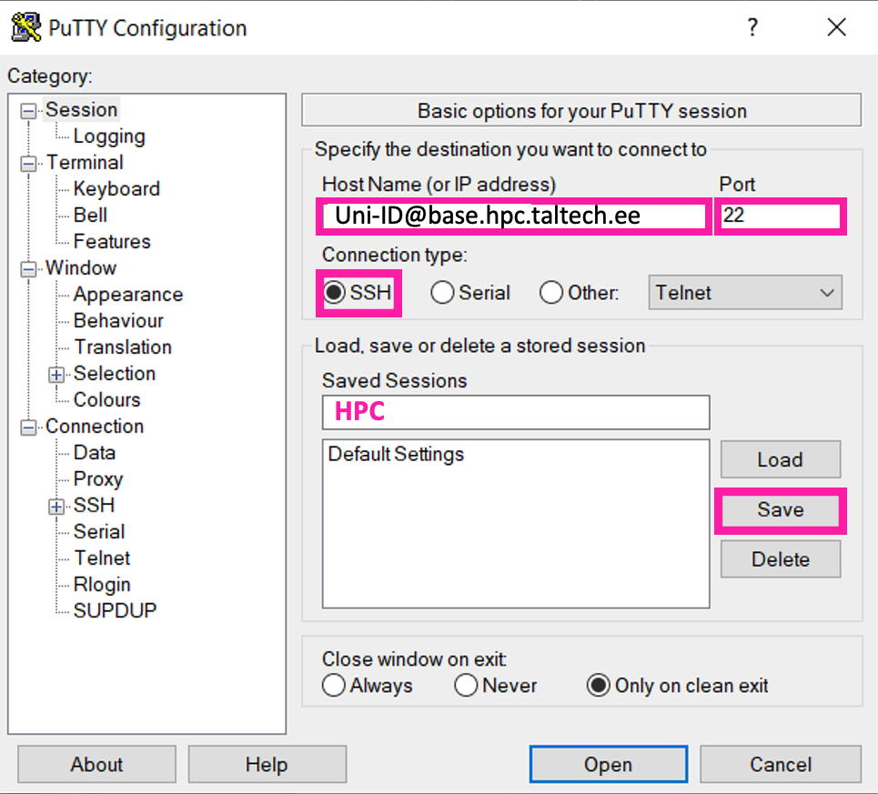
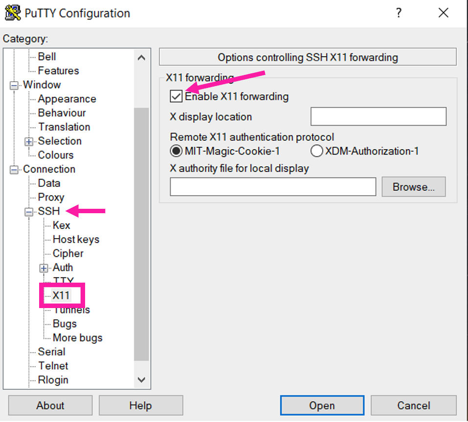

not changed to rocky yet

# Putty

PuTTY is a free and open-source terminal emulator for Windows, Mac and Linux. 
For TalTech Windows machines PuTTY client should be download from [Microsoft Apps](https://apps.microsoft.com/detail/xpfnzksklbp7rj?hl=en-US&gl=US), in a all other cases Putty can be download from the [official webpage](https://www.chiark.greenend.org.uk/~sgtatham/putty/latest.html).  

 

## Setup

---

1. Open Putty

2. Write host name, name of a session and save it.

	

3. To enable run of graphical applications, go to SSH and enable X11 forwarding.

	

 
 
