# Quickstart: Cluster 

 

## Accessing the cluster

---

**NB! To access the cluster, user must have an active [Uni-ID account](https://taltech.atlassian.net/wiki/spaces/ITI/pages/38994346/Uni-ID+ehk+Digitaalne+identiteet).** For people who are neither students nor employees of Taltech [Uni-ID non-contractual account](https://taltech.atlassian.net/wiki/spaces/ITI/pages/38994346/Uni-ID+ehk+Digitaalne+identiteet#External-UNI-ID) should be created by the head of a structural unit.

**To get access to HPC contact us by email (hpcsupport@taltech.ee) or [Taltech portal](https://taltech.atlassian.net/servicedesk/customer/portal/18).** We need the following information: uni-ID, department, project that covers [costs](https://docs.hpc.taltech.ee/#billing).

The login-node of the cluster can be reached by SSH. SSH (the Secure SHell) is available using the command `ssh` in **Linux/Unix, Mac** and **Windows-10.**  A guide for Windows users using PuTTY (an alternative SSH using a graphical user interface (GUI)) is [here](putty.md).

For accessing the cluster **base.hpc.taltech.ee** use command:

    ssh uni-ID@base.hpc.taltech.ee

_**where uni-ID should be changed to user's uni-ID.**_

The cluster is accessible from inside the university and from major Estonian network providers. If you are traveling (or not on one of the major networks), the access requires [FortiVPN](https://taltech.atlassian.net/wiki/spaces/ITI/pages/38994267/Kaug+hendus+FortiClient+VPN+Remote+connection+with+FortiClient+VPN) (with previously shown command) or a two-step login using a jump-host:

    ssh -l uni-ID@intra.ttu.ee uni-ID@proksi.intra.ttu.ee
    ssh uni-ID@base.hpc.taltech.ee

_where all uni-ID should be changed to user's uni-ID._

For using graphical applications add the `-X` switch to the SSH command, and for GLX (X Window System) forwarding additionally the `-Y` switch, so to be able to start a GUI program that uses GLX the connection command would be:

    ssh -X -Y uni-ID@base.hpc.taltech.ee

***NB!*** **The login-node is for some light interactive analysis. For heavy computations, request a (interactive) session on a compute node with the resource manager [SLURM](https://docs.hpc.taltech.ee/quickstart.html#running-jobs-with-the-slurm) or submit job for execution by SLURM sbatch script!**

**We strongly recommend to use SSH-keys for logging to the cluster.**

### _SSH fingerprints of host-keys_

SSH key fingerprint is a security feature for easy identification/verification of the host, user is connecting to. This option allows to connect to the server without a password. On first connect, user is shown a fingerprint of a host-key, and asked if it should be added to the list of known hosts.

Please compare the fingerprint to the ones below, if one matches, the host can be added, if the fingerprint does not match, then there is a problem (e.g. man-in-the-middle-attack).

SSH host keys of our servers

**base.hpc.taltech.ee**
-   ECDSA SHA256:OEfQiOB/eIG8hYoQ25sQk9T5tx9EtQbhi6sNM4C8mME
-   ED25519 SHA256:t0CSTU0AnSsJThzuM68tucrcfnn2wLKabjSnuRKX8Yc
-   RSA SHA256:qYrmOw/YN7wf640yBHADX3wnAOPu0OOXlcu4LKBxzG8   

.  

**amp.hpc.taltech.ee**
-   ECDSA SHA256:yl6+VaKow6qDZAXL3rQY8+3d3pcH0kYg7MjGgNVTWZs
-   ED25519 SHA256:YOjtpcEL2+AWm6vDFjVl0znYuQPMSVCkyFGvdO5fm8o
-   RSA SHA256:4aaOxumH1ATNfiIA4mZSNMefvxfdFm5zZoUj6VR7TYo   

.   
  
**viz.hpc.taltech.ee**
-   ECDSA SHA256:z2/bxleZ3T3vErkg4C7kvDPKKEU0qaoR8bL29EgMfGA
-   ED25519 SHA256:9zRBmS3dxD7BNISZKwg6l/2+6p4HeqlOhA4OMBjD9mk
-   RSA SHA256:Q6NDm88foRVTKtEAEexcRqPqMQNGUzf3rQdetBympPg

[How to get SSH keys](ssh.md).

 
 

## Structure and file tree 

---

By accessing the cluster, the user gets into his home directory or `$HOME` (`/gpfs/mariana/home/$USER/`).

In the home directory, the user can create, delete, and overwrite files and perform calculations (if slurm script does not force program to use ` $SCRATCH ` directory). The home directory is limited in size of 500 GB and backups are performed once per week.

The home directory can be accessed from console or by GUI programs, but it cannot be mounted. For mounting was created special `smbhome` and `smbgroup` folders (`/gpfs/mariana/smbhome/$USER/` and `/gpfs/mariana/smbgroup/`, respectively). More about `smb` folders can be found [here](https://docs.hpc.taltech.ee/quickstart.html#smb-cifs-exported-filesystems).

Some programs and scripts suppose that files will be transfer to `$SCRATCH` directory at compute node and calculations will be done there. If job will be killed, for example due  to the time limit back transfer will not occur. In this case, user needs to know at which node this job was running (see `slurm-$job_id.stat`), to connect to exactly this node (in example it is green11). `$SCRATCH` directory will be in `/state/partition1/` and corresponds to jobID number.

	srun -w green11 --pty bash
	cd /state/partition1/

Please note that the scratch is *not* shared between nodes, so parallel MPI jobs that span multiple nodes cannot access each other's scratch files.

 
 

## Running jobs with SLURM 

---

SLURM is a management and job scheduling system at Linux clusters. SLURM quick reference can be found [here](https://slurm.schedmd.com/pdfs/summary.pdf).

Examples of slurm scripts are usually given on the program's page with some recommendations for optimal use of resources for this particular program. List of the programs installed at HPC is given on our [software page](software.md). At software page or program's page also can be found information about licenses, since programs installed at HPC have varying licence agreement. To use some licensed programs (for example, Gaussian), the user must be added to the appropriate group. For this contact us by email (hpcsupport@taltech.ee) or [Taltech portal](https://taltech.atlassian.net/servicedesk/customer/portal/18).

The most often used SLURM commands are:

 - `srun` - to start a session or an application (in real time)
 - `sbatch` - to start a computation using a batch file (submit for later execution)
 - `squeue` - to check the load of the cluster and status of own jobs
 - `sinfo` - to check the state of the cluster and partitions
 - `scancel` - to delete a submitted job (or stop a running one).

 

For more parameters see the man-pages (manual) of the commands `srun`, `sbatch`, `sinfo` and `squeue`. For this use the command `man` followed by the program-name whose manual you want to see, e.g.:

    man srun

Requesting resources with SLURM can be done either with parameters to `srun` or in a batch script invoked by `sbatch`.

The following defaults are used if not otherwise specified:

 - **default memory** -- is 1 GB/thread (for larger jobs request more memory)
 - **short partition** -- **default time limit** is 10 min and  **max time limit** is 4 hours (longer jobs need to be submitted to partitions common, green-ib or gpu partitions)
 - **common partition** --  **default time** is 10 min and **max time limit** is 8 days.
-   **long partition** -- **default time** is 10 min and **time limit** 15 days.
 - **green-ib partition** -- **default time** is 10 min and **max time limit** is 8 days
 - **bigmem partition**  -- **default time** is 10 min and **max time limit** is 8 days
 - **gpu partition** -- **default time** is 10 min and **max time limit** is 5 days
 
 
  

**Running an interactive session** longer than default 10 min. (here 1 hour):

    srun -t 01:00:00 --pty bash 

This logs you into one of the compute nodes, there you can load modules and run interactive applications, compile your code, etc.

With `srun` is reccomended to use CLI (command-line interface) instead of GUI (Graphical user interface) programs if it is possible. For example, use octave-CLI or octave instead of octave-GUI.

**Running a simple non-interactive single process job** that lasts longer than default 4 hours (here 5 hours):

    srun --partition=common -t 05:00:00 -n 1 ./a.out

***NB!*** *Environment variables for OpenMP are *not* set automatically, e.g.*

    srun  -N 1 --cpus-per-task=28 ./a.out

would *not* set `OMP_NUM_THREADS` to 28, this has to be done manually. So usually, for parallel jobs it is recommended to use scripts for `sbatch`. 

Below is given an example of batch slurm script (filename: `myjob.slurm`) with explanation of the commands. 

    #!/bin/bash
    #SBATCH --partition=common    ### Partition
    #SBATCH --job-name=HelloOMP   ### Job Name           -J
    #SBATCH --time=00:10:00       ### WallTime           -t
    #SBATCH --nodes=4             ### Number of Nodes    -N 
    #SBATCH --ntasks-per-node=7   ### Number of tasks (MPI processes)
    #SBATCH --cpus-per-task=4     ### Number of threads per task (OMP threads)
    #SBATCH --account=hpcrcf      ### In case of several accounts, specifies account used for job submission
    #SBATCH --mem-per-cpu=100     ### Min RAM required in MB
    #SBATCH --array=13-18         ### Array tasks for parameter sweep
    
    export OMP_NUM_THREADS=$SLURM_CPUS_PER_TASK		### setup environment
    module load gcc						### setup environment
    ./hello_omp $SLURM_ARRAY_TASK_ID			### only for arrays, setup output files with system information
    mpirun -n 28 ./hello_mpi 				### run program

In this example are listed some of the more common submission parameters. There are many more possible job-submission options, moreover, some of the options listed above  are not useful to apply together. An explanation of the variables used inside SLURM/SBATCH can be found [here](https://slurm.schedmd.com/sbatch.html#lbAJ). In contrast to e.g. GridEngine, SLURM allows fine-grained resource requests, using parameters like `--ntasks-per-core` or `--ntasks-per-node`.

 
 <a href="https://docs.hpc.taltech.ee/slurm_example.html">An example script for submitting</a>:

 - a single process job
 - an OpenMP parallel job 
 - an MPI parallel job (OpenFOAM) 
 - an array (parameter sweep) job 
 - a GPU job 
 - a job using the scratch partition (sequential or OpenMP parallel)

 
 

The job is then submitted to SLURM by

    sbatch myjob.slurm

and will be executed when the requested resources become available.

Output of applications and error messages are by default written to a `slurm-$job_id.out` file. More about SLURM finished job statistics can be found [here](slurm_statistics.md).

Some useful online resources:

 - [SLURM scheduler workload manager](https://slurm.schedmd.com/pdfs/summary.pdf)
 - Victor Eijkhout: Introduction to High-Performance Scientific Computing 
 - [Charles Severance, Kevin Dowd: High Performance Computing](http://cnx.org/content/col11136/1.5/)
 - [OpenMP standard](https://www.openmp.org/)
 - [MPI standard](https://www.mpi-forum.org/)
 - [SLURM Quick Reference (Cheat Sheet)](https://slurm.schedmd.com/pdfs/summary.pdf)
 
  

 
 
 

## SLURM accounts  

---

In SLURM exist accounts for billing, these are different from the login account!

Each user has his/her own personal SLURM-account, which will have a monthly limit and at least one project account for larger calculations.

SLURM user-accounts start with `user_` and project accounts with `project_` and course accounts with `course_`, followed by uniID/projectID/courseID. You can check which SLURM accounts you belong to, by `sacctmgr show associations format=account%30,user%30 | grep uniID` . Currently (almost) all users belong to the SLURM-account "vaikimisi" (default), it is possible to submit jobs under this account, especially if no `user_` or project account has been created for you yet, however, "vaikimisi" will be discontinued in the near future.

When submitting a job, it is important to use the correct SLURM-account `--account=SLURM-ACCOUNT`, as this is connected to the financial source.

  
 
 

## Monitoring jobs & resources

---

### Monitoring a job on the node

#### Status of a job

User can check the status his jobs (whether they are running or not, and on which node) by the command:

	squeue -u $USER

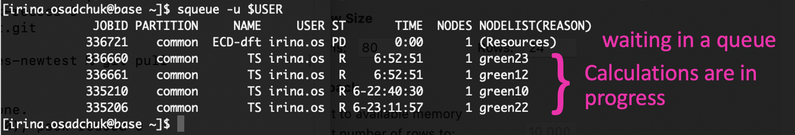

#### Load of the node

User can check the load of the node his job runs on, status and configuration of this node by command

	scontrol show node <nodename>

the load should not exceed the number of hyperthreads (CPUs in SLURM notation) of the node.

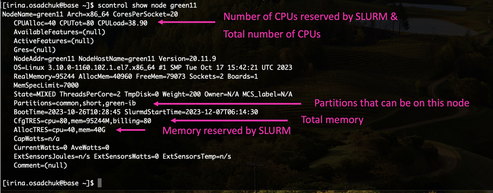

In case of MPI parallel runs statistics of several nodes can be monitored by specifying nodes names. For example:  

	scontrol show node=green[25-26]

Node features for node selection using `--constraint=`:

| feature | what it is |
|----------|-----------|
| A100-40 | has A100 GPU with 40GB |
| A100-80 | has A100 GPU with 80GB |
| L40 | has L40 GPU with 48GB |
| nvcc80 | GPU has compute capability 8.0 (A100, L40) |
| nvcc89 | GPU has compute capability 8.9  (L40) |
| nvcc35 | GPU has compute capability 3.5 (K20Xm, A100, L40) |
| zen2 | AMD Zen CPU architecture 2nd generation (amp1) |
| zen3 | AMD Zen CPU architecture 3rd generation (amp2) |
| zen4 | AMD Zen CPU architecture 4th generation (ada*) |
| avx512 | CPU has avx512 (skylake, zen4) |
| skylake | Intel SkyLake CPU architecture (green*) |
| sandybridge | Intel SandyBridge CPU architecture (mem1tb, viz) |
| ib | InfiniBand network interface |

#### Monitoring with interactive job

It is possible to submit a second interactive job to the node where the main job is running, check with `squeue` where your job is running, then submit

	srun -w <nodename> --pty htop

Note that there must be free slots on the machine, so if you cannot use `-n 80` or `--exclusive` for your main job (use `-n 79`).

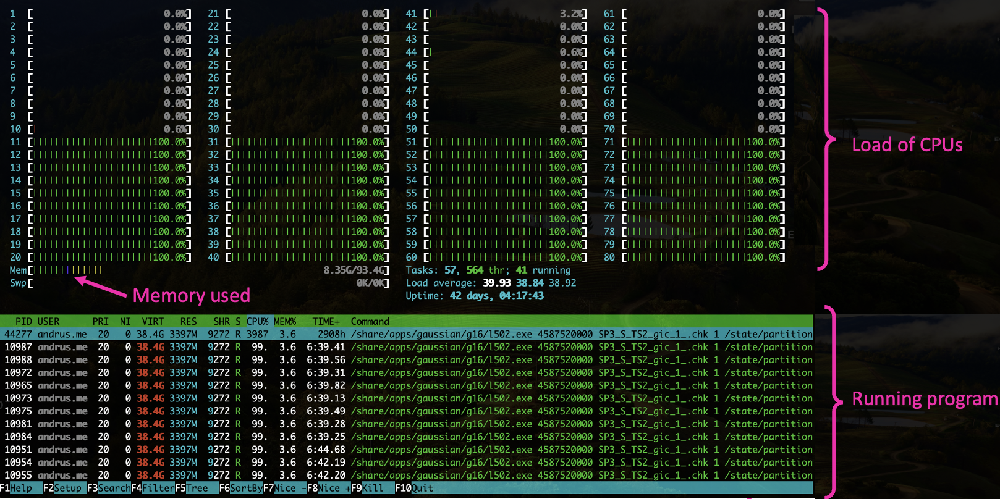

Press `q` to exit.

You can also add a column that shows the CPU number of the program (for more details click here).

For Linux **F1-F10** keys should be used, for **Mac** - just click on the corresponding buttons.

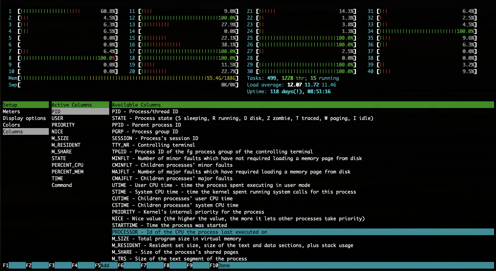

Will appear a new column, showing the CPU number of the program.

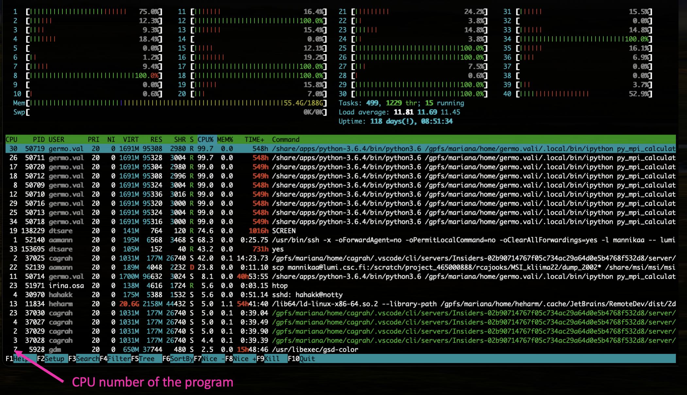

   

 

#### Monitoring jobs using GPUs

Log to **amp** or **amp2**. Command 

	echo ${SLURM_STEP_GPUS:-$SLURM_JOB_GPUS} 

shows the GPU IDs allocated to your job.

GPUs load can be checked by command:
	
	nvidia-smi

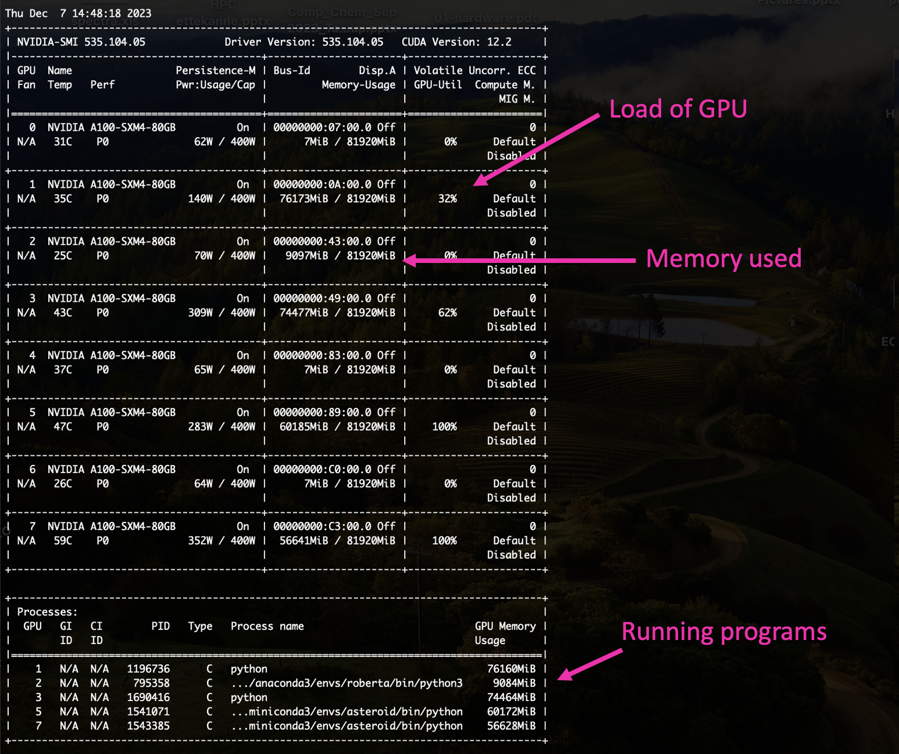

Press `control+c` to exit.

Another option is to logging to **amp** or **amp2**, check which GPUs are allocated to your job, and give command:
	
	nvtop

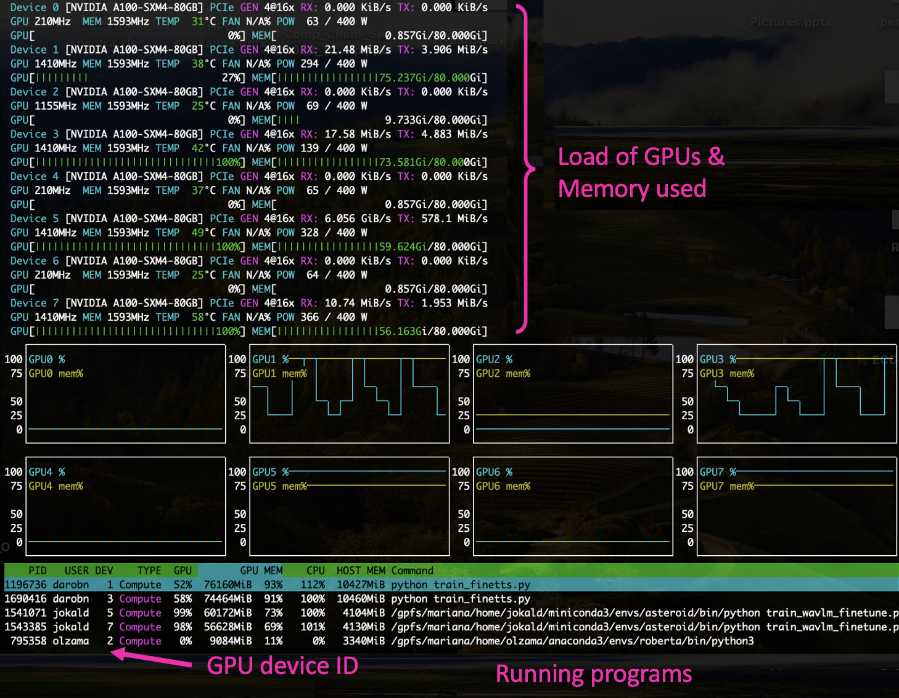

Press `q` to exit.
    
An alternative method **on Linux computers,** if you have X11. Logging to **base/amp** with `--X` key:

	ssh --X UniID@base.hpc.taltech.ee

then submit your main interactive job 

	srun --x11 -n <numtasks> --cpus-per-task=<numthreads> --pty bash

and start an `xterm -e htop &` in the session.

In `sbatch` the option `--x11=batch` can be used, note that the ssh session to **base** needs to stay open!

### Monitoring resource usage

Default disc quota for `home` (that is backed up weekly) is 500 GB and for `smbhome` (that is not backed up) -- 2 TB per user. For `smbgroup` there is no limits and no backup.

The easiest way to check your current disk usage is to look at the table that appears when you log in to HPC. 

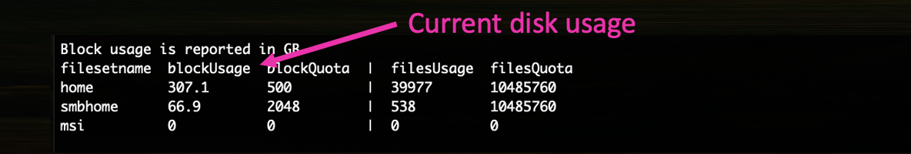

You can also monitor your resource usage by `taltech-lsquota.bash` script and `sreport` command. 

Current disk usage:

    taltech-lsquota.bash

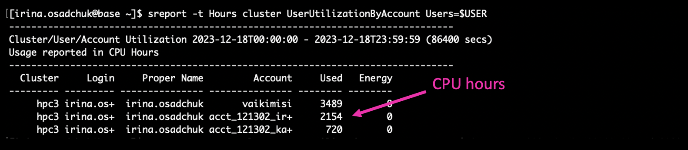

CPU usage during last day:

    sreport -t Hours cluster UserUtilizationByAccount Users=$USER

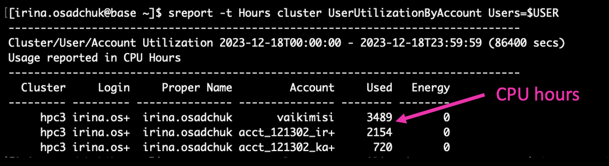

CPU usage in specific period (e.g. since beginning of this year):

    sreport -t Hours cluster UserUtilizationByAccount Users=$USER start=2024-01-01T00:00:00 end=2024-12-31T23:59:59

Where `start=` and `end=` can be changed depending on the desired period of time. 

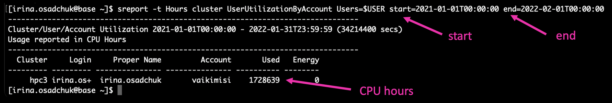

For convenience, a tool `taltech-history` was created, by default it shows the jobs of the current month, use `taltech-history -a` to get a summary of the useh hours and costs of the current month.

 
 

## Copying data to/from the clusters

---

Since HPC disk quota is limited, it is recommended to have your own copy of important calculations and results. Data from HPC can be transferred by several commands: `scp`, `sftp`, `sshfs` or `rsync`.

1. `scp` is available on all **Linux systems,** **Mac** and **Windows10 PowerShell.** There are also GUI versions available for different OS (like [PuTTY](putty.md)).

    Copying ***to*** the cluster with `scp`:

       scp local_path_from_where_copy/file uni-id@base.hpc.taltech.ee:path_where_to_save

    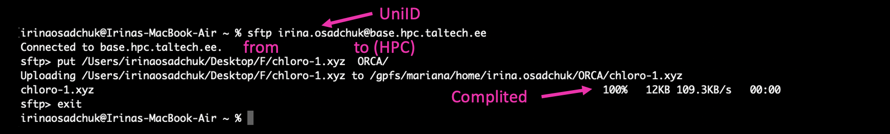

    Copying ***from*** the cluster with `scp`:

       scp uni-id@base.hpc.taltech.ee:path_from_where_copy/file local_path_where_to_save 

    

    Path to the file at HPC can be checked by  `pwd` command.

       
2. `sftp` is the secure version of the `ftp` protocol vailable on **Linux,** **Mac** and **Windows10 PowerShell.** This command starts a session, in which files can be transmitted in both directions using the `get` and `put` commands. File transfer can be done in "binary" or "ascii" mode, conversion of line-endings (see below) is automatic in "ascii" mode. There are also GUI versions available for different OS ([FileZilla](https://filezilla-project.org/), [gFTP](https://github.com/masneyb/gftp) and [WinSCP](https://winscp.net/eng/index.php) (Windows))

       sftp uni-id@base.hpc.taltech.ee

    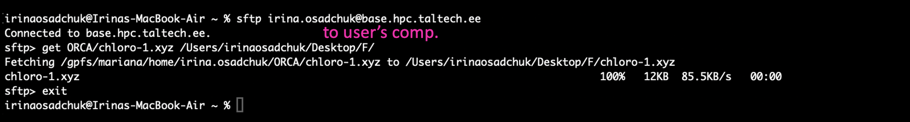

3.  `sshfs` can be used to temporarily mount remote filesystems for data transfer or analysis. Available in **Linux.** The data is tunneled through an ssh-connection. Be sware that this is usually not performant and can creates high load on the login node due to ssh-encryption.
 
        sshfs uni-id@base.hpc.taltech.ee:remote_dir/ /path_to_local_mount_point/

    
4. `rsync` can update files if previous versions exist without having to transfer the whole file. However, its use is recommended **for the advanced user only** since one has to be careful with the syntax.

### SMB/CIFS exported filesystems

One of the simple and convenient ways to control and process data based on HPC is mounting. Mounting means that user attaches his directory placed at HPC to a directory on his computer and can process files as if they were on this computer. These can be accessed from within university or from [EduVPN](https://eduvpn.taltech.ee/vpn-user-portal/home).

Each user automatically has a directory within `smbhome`. It does not match with `$HOME` directory, so calculations should be initially done at `smbhome` directory to prevent copying or files needed should be copied from `home` directory to the `smbhome` directory by commands:

    pwd	### look path to the file 
    cp path_to_your_file/your_file /gpfs/mariana/smbhome/$USER/	### copying

To get a directory for group access, please contact us (a group and a directory need to be created).

The HPC center exports two filesystems as Windows network shares:

| local path on cluster | Linux network URL | Windows network URL |
|-----------------------|-------------------|---------------------|
|    /gpfs/mariana/smbhome/$USER | smb://smb.hpc.taltech.ee/smbhome | \\\\smb.hpc.taltech.ee\smbhome | 
|    /gpfs/mariana/smbgroup | smb://smb.hpc.taltech.ee/smbgroup | \\\\smb.hpc.taltech.ee\smbgroup |
|    /gpfs/mariana/home/$USER | not exported | not exported |

**This is the quick-access guide, for more details, see [here](samba.html)**

#### Windows access

The shares can be found using the Explorer "Map Network Drive".

    server >>> \\smb.hpc.taltech.ee\smbhome
    username >>> INTRA\<uni-id>

From Powershell: 

     net use \\smb.hpc.taltech.ee\smbhome /user:INTRA\uni-id
     get-smbconnection

#### Linux access

On Linux with GUI Desktop, the shares can be accessed with the nautilus browser.

From commandline, the shares can be mounted as follows:

    dbus-run-session bash
    gio mount smb://smb.hpc.taltech.ee/smbhome/

you will be asked for "User" (which is your UniID), "Domain" (which is "INTRA"), and your password.

To disconnect from the share, unmount with

    gio mount -u smb://smb.hpc.taltech.ee/smbhome/

### Special considerations for copying Windows - Linux

Microsoft Windows is using a different line ending in text files (ASCII/UTF8 files) than Linux/Unix/Mac: CRLF vs. LF
When copying files between Windows-Linux, this needs to be taken into account. The FTP (File Transfer Protocol) has ASCII and BINARY modes, in ASCII-mode the line-end conversion is automatic.

There are tools for conversion of the line-ending, in case the file was copied without line conversion: `dos2unix`, `unix2dos`, `todos`, `fromdos`, the stream-editor `sed` can also be used.

 
 

## Backup

---

There are 2 major directories where users can store data:

- `/gpfs/mariana/home/` default home directory which is limited to 500GB and is backed up, excluding specific directories: `[*/envs/, */.cache/, */pkgs/]`.
- `/gpfs/mariana/smbhome/` has a limit of 2TB and is not backed up.

The home directory is meant for critical data like configurations and scripts, whereas smbhome is meant for data.

The backup will run weekly. *If the home directory is larger than 500GB [usage is displayed upon login to the cluster] it will not be backed up.*

If your home directory is larger than 500G please move the data to smbhome.

---

At HPC are installed programs with varying licence agreement. To use some licensed programs (for example, Gaussian), the user must be added to the appropriate group. For this contact us email (hpcsupport@taltech.ee) or [Taltech portal](https://portal.taltech.ee/v2). More about available programs and licenses can be found at [software page](https://docs.hpc.taltech.ee/software.html).

 
