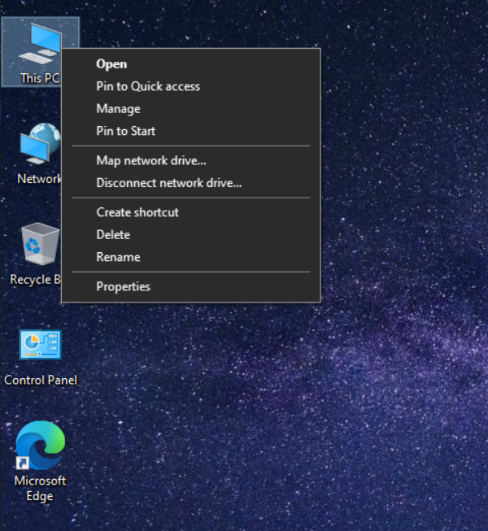
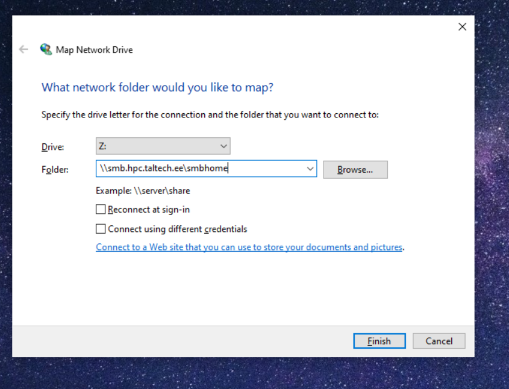
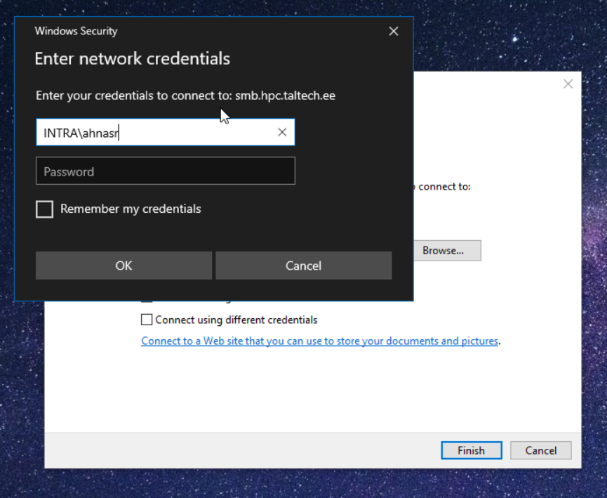

not changed to rocky yet

# Accessing SMB/CIFS network shares

---

The HPC center exports two filesystems as Windows network shares:

| local path on cluster | Linux network URL | Windows network URL |
|-----------------------|-------------------|---------------------|
|    /gpfs/mariana/smbhome/$USER | smb://smb.hpc.taltech.ee/smbhome | \\\\smb.hpc.taltech.ee\smbhome | 
|    /gpfs/mariana/smbgroup | smb://smb.hpc.taltech.ee/smbgroup | \\\\smb.hpc.taltech.ee\smbgroup |
|    /gpfs/mariana/home/$USER | not exported | not exported |

These can be accessed from within university or from EduVPN.

Each user automatically has a directory within smbhome. To get a directory for group access, please contact us (a group and a directory need to be created).

## Windows access

---

From Windows, the shares can be found using the Explorer "Map Network Drive".

GUI:

right click on myPC add network location or Map network

    server >>> \\smb.hpc.taltech.ee\smbhome
    username >>> INTRA\<uni-id>

 
 
 
 

Powershell:

run `net use \\smb.hpc.taltech.ee\smbhome /user:INTRA\<uni-id>`
check success with `get-smbconnection`

## Linux access

---

On Linux with GUI Desktop, the shares can be accessed with nautilus browser.

From Linux commandline, the shares can be mounted as follows:

    dbus-run-session bash
    gio mount smb://smb.hpc.taltech.ee/smbhome/

or

    dbus-run-session bash
    gio mount smb://smb.hpc.taltech.ee/smbgroup/

you will be asked for "User" (which is your UniID), "Domain" (which is "INTRA"), and your password.

To disconnect from the share, unmount with

    gio mount -u smb://smb.hpc.taltech.ee/smbhome/
    gio mount -u smb://smb.hpc.taltech.ee/smbgroup/

If you get "Error mounting location: Location is not mountable", then you are not in the correct network (e.g. VPN is not running), or you don't have a dbus session.

On Debian, the following packages need to be installed: `gvfs gvfs-common gvfs-daemons gvfs-fuse gvfs-libs libsmbclient gvfs-backends libglib2.0-bin`
