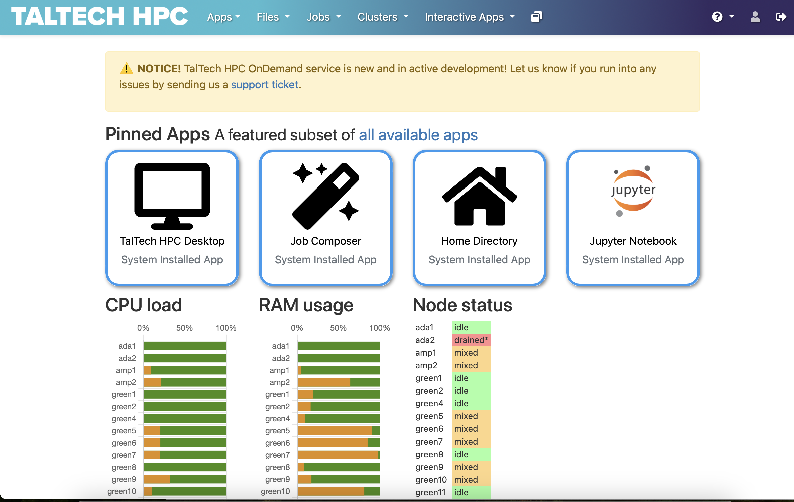

# Visualization

The recommended way of doing visualizations is now using the **desktop session** on [https://ondemand.hpc.taltech.ee](https://ondemand.hpc.taltech.ee).

OnDemand is a graphical user interface that allows access to HPC via a web browser. Within the OnDemand environment users can access to a HPC files, submit jobs to a cluster, monitor jobs and HPS resources, run interactive applications like Jupyter.  

The default desktop environment is xfce, which is configurable, lightweight and fast.

 

## OnDemand Desktop on any node and CPU

---

The menu only contain very few programs from the operating system. However, **all installed software can be open an XTerminal** using the module system as you would from the command-line. To do that: 

1. Choose "TalTech HPC Desktop". 

    
 

    

    

2. Set up and launch an interactive desktop (1 core and 1 GB of memory is usually enough if no calculations are planned).

    
 

    

    

    ***NB!*** _Check and your account._ 

3. Firstly, your request will be put into a queue and this picture will appear. 

    
 

    

    

4. When needed resources will become available, your session will start and this picture will appear. 

    We recommend to use default settings for "Compression" and "Image Quality", unless you require high-quality screenshots.

    
 

    

    

    ***NB!*** _Do not use quality settings "Compression 0" and/or "Image Quality 9", this will cause a zlib error message. The message box can be removed by reloading the browser tab._ 

    
 

    

    

5. To start interactive desktop press "Launch TalTech HPC Desktop"

    Will appear your HPC Desktop, where user can open XTerminal.

    
 

    

    

5. To start interactive desktop press "Launch TalTech HPC Desktop"

    Load environment and program needed and start vizualization. More detailed instructions on environment and program loading are given below. 

    
 

    

    

### _Available visualization software on compute nodes_

Program from a list below and its environment can be loaded by:

	module load rocky8-spack
	module load <program name>

_where **program** must be written in **lowercase letters**_ 

-   ParaView 
-   VisIt 
<!-- -   COVISE -->
-   Py-MayaVi 
<!-- -   OpenDX -->
-   Molden
<!-- -   VAPOR -->
-   VMD 
-   Ovito
-   Ospray (raytracer)
-   PoVray (raytracer)

 

Programs are run by corresponding names in lowercase letters: **paraview** / **visit** / **vmd**.

#### GaussView & Avogadro

GaussView can be started by commands:

	module load rocky8/all
	module load gaussview
	gview.sh <job name>

To run Avogadro:

	module load rocky8/all
	module load avogadro
	avogadro <job name>

 

## OnDemand Desktop on GPU nodes (hardware rendering)

---

Requires of course to be submitted to a GPU node and a GPU to be reserved. The nodes are configured in a way that requires EGL rendering, and therefore may require other modules to be loaded (e.g. ParaView).

Otherwise the Desktop works as the regular (software rendering) one, see above.

Please note that for most applications software rendering is fast enough, only heavy visulalization, like volume visualization in ParaView, COVISE, VisIt, VMD, Star-CCM+ and Ansys may require the GPU rendering.

**Check using `nvtop` that your application actually uses the GPU!!!**

### _ParaView with EGL acceleration_

It is not possible to have EGL rendering and the OpenGL GUI compiled together, therefore the EGL accelerated `pvserver` and the OpenGL GUI come from different modules and can run on different compute nodes.

The startup procedure for EGL accelerated rendering is the same as for use of ParaView in distributed mode.

1. Start an OnDemand desktop on a GPU node and request a GPU
2. Open 2 XTerms
3. in Xterm 1: `module load rocky8-spack paraview/5.12.1-gcc-10.3.0-dotq` and start the ParaView GUI `paraview`
4. in Xterm 2: `module load rocky8 paraview/5.12.1-egl` and start the ParaView server `pvserver` (alternatively, you could ssh into base and start a separate job on a gpu node with srun or sbatch)
5. in GUI select "Connect" and connect to either localhost:11111 or the gpu node the pvserver runs on, use "manual" connect, then choose "connect".

A similar procedure can also be used to connect a client running on your desktop computer to the pvserver on the compute node.

For more explanations, see (ParaView WIKI)[https://www.paraview.org/Wiki/Reverse_connection_and_port_forwarding].

### _StarCCM+ with hardware rendering_

    vglrun starccm+ -clientldpreload /usr/lib64/libvglfaker.so -graphics native -rgpu auto  -power -fabric TCP -podkey $YOURPODKEY ...

 

## _In-situ visualization (in preparation)_

In-situ visualization creates the visualization during the simulation instead of during the postprocesssing phase. The simulation code needs to be connected to in-situ visualization libraries. e.g. Catalyst (ParaView), LibSim (VisIt) and Ascent.

The following are installed on our cluster

-   (Catalyst)[https://www.paraview.org/hpc-insitu/]
-   (Ascent)[https://github.com/Alpine-DAV/ascent]
-   LibSim
-   SENSEI

Ascent on all nodes

    module load rocky8-spack
    module load ascent

Catalyst on all nodes

    module load rocky8-spack
    module load libcatalyst/2.0.0-gcc-10.3.0-openblas-bp26

Catalyst can be used within OpenFOAM and (NEK5000)[https://github.com/KTH-Nek5000/InSituPackage] simulations.

 
 

