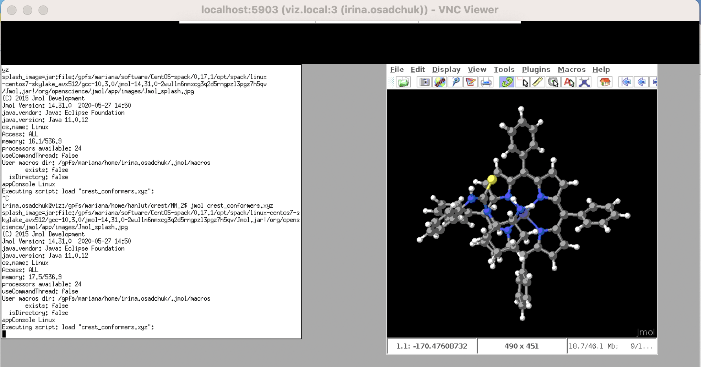

not changed to rocky yet

# Remote visualization using VNC

 

## Short guide

---

1. Connect to **viz**:

		ssh uni-ID@viz.hpc.taltech.ee

2. Start VNC on **viz** by command:

		vncserver -geometry 1265x980

3. Open a second connection to **viz**:

		ssh -L 59XX:localhost:50XX uni-ID@viz.hpc.taltech.ee

	where `XX` is the display number that appear after giving `vncserver` command.   
	***NB!*** _`XX` is always the number of two digits (e.g. `01` for `:1`)_

4. On your desktop start a vncviewer

    	vncviewer :XX

	where `XX` is the display number

5. **Stop the vncserver!!!** on **viz** by command:

    	vncserver -kill :XX

 
 
 

## Get started

---

### Software recommended to use

Virtual Network Computing (VNC) is a graphical desktop-sharing system to remotely control another computer.

The client (your desktop) computer needs a vncviewer

-   **Linux:** [xtigervncviewer](https://command-not-found.com/xtigervncviewer)
-   **Windows:** TigerVNCviewer: [vncviewer64-1.12.0.exe](https://sourceforge.net/projects/tigervnc/files/stable/1.12.0/vncviewer64-1.12.0.exe/download)
-   **Mac:** [VNC Viewer](https://www.realvnc.com/en/connect/download/viewer/)

 

### First time use

On the first start, VNC asks to specify a password to connect to the server, choose a secure one, which does not match your HPC/UniID password because VNC connections are not encrypted!

 

 
 

## VNC Long version 

---

VNC should be run firstly at **viz** node of HPC and after at user's computer.

1. Connect to **viz** by command:

	   ssh uni-ID@viz.hpc.taltech.ee

	if this command does not work try to connect through jump host:

		ssh -J uni-ID@base.hpc.taltech.ee uni-ID@viz 

	***NB!*** _Connection to **viz** can be done ***only*** with SSH keys. SSH key generation guide is [here](../ssh.md)._

	***NB!*** _To use **viz** the SSH key must be added to the **base** node._

	On Mac and Linux this can be done by command:

    	ssh-copy-id Uni-ID@base.hpc.taltech.ee

	After about an hour, when the automatic script has synced the files, and you can use **viz**.

2. On **viz** start the VNC server. Depending on which VNC client user has, one of those commands should be given:

		vncserver -geometry 1265x980

	and for Tiger VNC:

    	tigervncserver -geometry 1280x1024

	It is recommended to specify window size as well by `-geometry` flag, since changing the resolution of the remote desktop (= window size) at runtime can have undesired effects. 

3. The output in the terminal will show on which display VNC is running.

	 
 

	
	
	

	see second line `desktop at :8`, where `:8` is the display number -- further `XX`.

4. Open a second connection to **viz** (in new terminal) and give the command:

    	ssh -L 59XX:localhost:50XX uni-ID@viz.hpc.taltech.ee

	where `XX` is the display number as two digits (e.g. `01` for `:1`)

	***NB!*** _If you were connected through jump host this command should be given:_

		ssh -J Uni-ID@base.hpc.taltech.ee -L 59XX:127.0.0.1:59XX Uni-ID@viz

4. On **your desktop** start a VNC viewer. If you do it from terminal -- give one of these command depending on which VNC viewer you have:

    	vncviewer :XX

	or

    	xtigervncviewer localhost:XX

	where `XX` is the number from above. On Windows (depending on the VNC-client) the address to connect to could be `localhost::50XX` (again, the `XX` stands for the display/port as specified before).

If you use graphical interface - specify localhost - in the corresponding field (line in the top) and click bottom "Continue". 

 

Type password.

 

If you see monochromic field and can not start a session, it mean that you to set up your VNC session: [Setting up VNC config](https://docs.hpc.taltech.ee/visualization/vnc.html#setting-up-vnc-session).

If you see terminal - then everything is done correctly and you can start working. Within the session window, you can start any program from the terminal or using the menus of the window manager.

**Viz** has module system. Most of the modules are needed to be loaded unless the manual says they are native.

Before loading modules, the source must be specified:

    source /usr/share/lmod/6.6/init/bash
    module use /gpfs/mariana/modules/system
         
followed by two commands to load the modules. The first one loads ***viz-spack*** or ***viz module,*** depending on program installation type, and the second command loads the program itself.
For example:

     module load viz-spack
     module load jmol
     

 

In case of native program only the command that calls this program is needed.

    rasmol
    
or 

    paraview

 
 
 

## Correct termination

---

In is very important to finish session correctly! Since if you do not do it - session continue to run even if you close session on your computer. 

To stop VNC session give on **viz** one of these commands:

    vncserver -kill :XX

or

    tigervncserver -kill :XX

where `XX` is the display number.

Running sessions can be checked by command:

	vncserver -list

 

 
 

## Setting up VNC session 

---

It is impossible to work with VNC without setting it. To do this give the following commands from home catalogue on **base** or **viz**:

	cat  <<EOT > .xsession
	xterm &
	fvwm2
	EOT

This will configure automatic startup of  `xterm` and  `fvwm2` window manager. Alternatively, user can use other window managers: more desktop-like -- `fluxbox`, `awesome` or `jwm` or tiling -- `i3`, `xmonad` or `tritium`. To do this, the corresponding line must be added to `.xsession` file by command:

	echo  "fluxbox" >> .xsession

The same way `.vnc/xstartup` can be configured in case user wants to apply special settings exactly to VNC visualisation.
