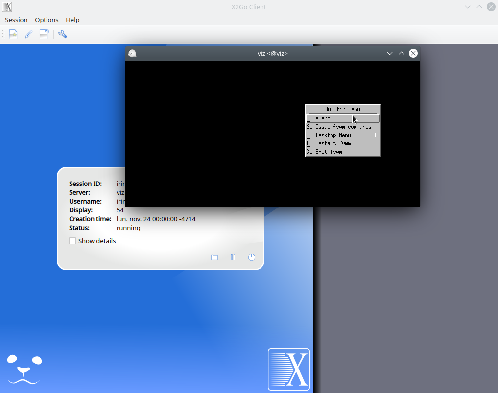

not changed to rocky yet

# Remote visualization using X2GO (easiest to get working)

The client (your desktop) computer needs the [X2GO-client](https://www.x2go.org)

***NB!*** _X2GO uses ssh-key. Ssh-key generation guide is [here](../ssh.md)._

_**NB!** To use **viz** the ssh-key must be added to the **base** node._

On Mac and Linux this can be done by command:

    ssh-copy-id Uni-ID@base.hpc.taltech.ee

After about an hour, when the automatic script has synced the files, and you can use **viz**.

 
 

## Configuring the client:

---

During first use X2GO-client needed to be configured as it is shown at the picture. To configure, select in the upper left corner "Session" tab.
The setting of the ssh-key is only necessary, if you use a non-standard name or not the default key.
 

Large memory consuming Desktop environments like MATE, KDE, GNOME are **not** available, use window managers like `blackbox` `fluxbox` `jwm` `fvwm2` `awesome` `lwm` `fvwm-crystal` (last setting on the screen).

If you select `Terminal` as "Session type" (use "fvwm2" as Command), you will get a "rootless" xterm and you can use that to start other software which will appear as individual windows on your regular desktop (not within a remote desktop window).

It is also recommended to configure the display settings, for example, as done in the example below or in some other suitable way, since changing the resolution of the remote desktop (= window size) at runtime is not possible (resizing the window would be the equivalent of stretching your physical monitor) or can have other undesired effects.
 

 
 

## Configuring the server-side:

---

A couple of config files need to be present:

-    `$HOME/.fvwm/.fvwm2rc` [.fvwm2rc](fvwm2rc.fvwm2rc) 
-    `$HOME/.xsessionrc-x2go` [.xsessionrc-x2go](xsessionrc-x2go.xsessionrc-x2go) (can be a link to .xsessionrc, .xsession, or .vnc/xstartup) 

If the files are not present, just **copy them from** `/etc/skel/` or run

    curl https://docs.hpc.taltech.ee/visualization/fvwm2rc.fvwm2rc --create-dirs -o $HOME/.fvwm/.fvwm2rc
    curl https://docs.hpc.taltech.ee/visualization/xsessionrc-x2go.xsessionrc-x2go --create-dirs -o $HOME/.xsessionrc-x2go

to copy/save the example configs.

 
 

## X2GO run & use

---

`$HOME` on **base**  coincide with `$HOME` on **viz**.

When session is configured, press `enter` to run session. Press left bottom of the mouse to call menu and choose XTerm.

Will appear terminal where user can call the desired visualization program. We do *not* maintain the list of software in the menues of window managers or desktop environments, that means even with a graphical frontend, you still need to use the command-line to start your programs! You can configure the menues yourself, e.g. in the `$HOME/.fvwm/.fvwm2rc` file for the fvwm window manager.

**Viz** has module system. Most of the modules are needed to be loaded unless the manual says they are native.

Before loading modules, the source must be specified the source:

    source /usr/share/lmod/6.6/init/bash
    module use /gpfs/mariana/modules/system
       
followed by module load commands, for example:

     module load viz-spack
     module load jmol
     
     

In case of native program only the command that calls this program is needed.

    rasmol
    
or 

    paraview

    
***NB!*** _ParaView and maybe other software using GLX needs to be started using VirtualGL: `vglrun paraview`_

    

 
 

## Terminate X2GO run 

---

It is extremely important to end session in proper way! To do this 
1. Print `exit` in your terminal
2. Click left mouth buttom, call menu and choose `Exit fvwm`.

 
